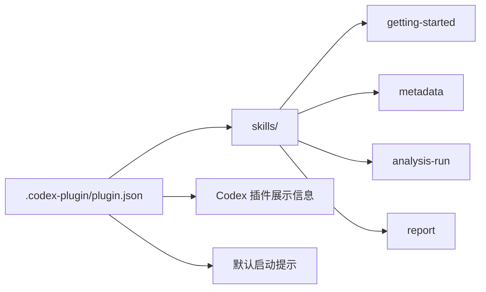

# Codex Plugin

这个目录保存 RealAnalyst 的 Codex 插件声明。普通用户通常不需要修改这里，但如果你想理解“为什么 Codex 能识别这些 skills”，先看这里。

---

## 这里有什么？

| 文件 | 作用 |
| --- | --- |
| `plugin.json` | 插件清单，声明插件名称、版本、描述、skills 目录、默认 prompt、隐私和条款链接 |

---

## 它在整体架构中的位置



`plugin.json` 只负责“告诉 Codex 这个项目有哪些 skill”。
真正的业务流程、取数规则、报告规则都在 `skills/`、`metadata/` 和 `runtime/` 中。

---

## 什么时候需要改这里？

| 场景 | 是否需要改 |
| --- | --- |
| 只是使用 RealAnalyst 做分析 | 不需要 |
| 新增或删除 skill 目录 | 通常不需要，除非 skills 根目录变化 |
| 修改插件展示名、简介、默认 prompt | 需要修改 `plugin.json` |
| 修改隐私政策或服务条款路径 | 需要修改 `plugin.json` |
| 调整 metadata / runtime / report 逻辑 | 不应该改这里 |

---

## 修改后如何检查？

```bash
python3 -m json.tool .codex-plugin/plugin.json
```

如果命令能正常格式化输出，说明 JSON 语法有效。

---

## 常见问题

| 问题 | 说明 |
| --- | --- |
| 能不能把真实密钥放在 `plugin.json`？ | 不能。这里会进入公开仓库，不保存任何密钥。 |
| skills 不生效怎么办？ | 先确认 `plugin.json` 中的 `skills` 是否指向 `./skills/`，再确认各 skill 目录内存在 `SKILL.md`。 |
| 默认 prompt 是必须的吗？ | 不是必须，但建议保留，帮助新用户知道第一步该做什么。 |
