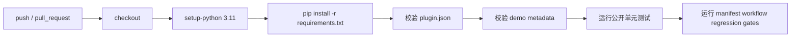

# GitHub Workflows

这里保存公开仓库可运行的 GitHub Actions workflow。
当前 CI 的目标不是覆盖所有真实数据场景，而是保证公开仓库里的基础文件没有明显断点。

---

## 当前 CI 做什么？

---

## 文件说明

| 文件 | 作用 |
| --- | --- |
| `ci.yml` | 运行轻量公开校验：安装依赖、校验插件声明、校验 demo metadata、公开单元测试和 manifest workflow regression gates |
| `issue-spam-moderation.yml` | 监听 issue / issue comment，命中 `Payment Address` 垃圾内容时自动处理；评论会删除，issue 正文会被清理并关闭 |

---

## Issue Spam Moderation

`issue-spam-moderation.yml` 使用仓库默认 `GITHUB_TOKEN` 和最小权限：

- `contents: read`：checkout moderation 脚本。
- `issues: write`：删除 issue comment，或清理并关闭 spam issue。

边界：

- 只匹配明确的 `Payment Address` 字样，不做泛化反垃圾分类。
- GitHub 仓库级 workflow 不适合自动 block 用户；block 需要个人账号 `user` scope，应由仓库 owner 手动处理。

---

## 为什么 CI 只做轻量校验？

公开仓库不会上传真实：

- Tableau token
- DuckDB 数据库
- Tableau registry.db
- 真实 metadata sync 快照
- `jobs/` 运行产物

因此 CI 只运行不依赖私有环境的检查，包括 `python -m unittest discover -s tests` 和 `python scripts/run_manifest_workflow_regression.py`。真实连接、取数、报告生成建议在本地或私有 CI 中验证。

---

## 可选增强

| 增强项 | 价值 |
| --- | --- |
| README 链接检查 | 防止文档路径失效 |
| Markdown lint | 让表格、标题层级更稳定 |
| 更多 schema 样例 | 确认新增 artifact schema 与 demo 输出一致 |
| Skill frontmatter 检查 | 确认每个 `SKILL.md` 都有 name 和 description |
| README 同步检查 | 防止 `skills/README.md` 漏掉新增 skill |

---

## 常见卡点

| 卡点 | 处理 |
| --- | --- |
| CI 在依赖安装失败 | 检查 `requirements.txt` 是否可在干净 Python 3.11 环境安装 |
| metadata validate 失败 | 先修 `metadata/datasets/demo.*.yaml` 或对应 schema |
| plugin manifest 失败 | 运行 `python3 -m json.tool .codex-plugin/plugin.json` 定位 JSON 语法错误 |
