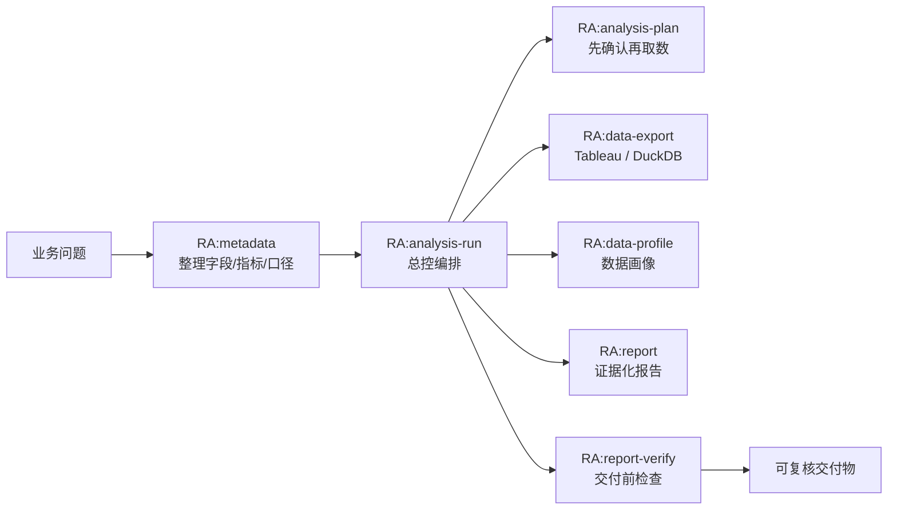
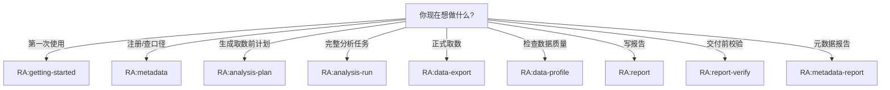

# RealAnalyst


RealAnalyst 是给 Codex 使用的数据分析工作台。它帮你把一次业务分析从“先问清楚口径”推进到“取数、画像、写报告、交付前检查”，中间每一步都留下可复核的证据。

## 安装和更新

### 安装到当前 Codex 项目

```bash
curl -fsSL https://raw.githubusercontent.com/dabaige53/RealAnalyst/main/scripts/install_codex_plugin.py | python3 -
```

默认只在当前项目启用，不会影响其他项目。

默认版本策略是 `latest`：安装器会把插件仓库保持在 `main` 最新状态。安装器会把策略写入 `~/plugins/realanalyst/.realanalyst-install.json`，以后重新运行安装命令时会沿用该策略。

安装脚本只写入插件相关文件：

- 注册当前项目的 `.agents/plugins/marketplace.json`
- 安装项目内 `.agents/skills/`
- 安装或更新项目内 `runtime/` 执行支持文件（不复制 `registry.db`、缓存或本地生成数据）
- 初始化插件目录里的 `~/plugins/realanalyst/.env`，已有则保留

它不会创建 `metadata/`、`jobs/`、`logs/`，不会写当前项目的 `.env` / `.gitignore`，也不会写入 demo 数据或真实 registry。只有用户确认要保存抽取结果或执行分析产物时，RealAnalyst 才会按需创建业务工作区文件夹。

### 更新已安装的 RealAnalyst

已经装过且版本策略是 `latest` 时，直接在目标项目里重新执行同一条命令即可。安装脚本会更新 `~/plugins/realanalyst`，保留已有 `.env`，并刷新当前项目的 `.agents/skills/` 和 `runtime/` 支持文件：

```bash
curl -fsSL https://raw.githubusercontent.com/dabaige53/RealAnalyst/main/scripts/install_codex_plugin.py | python3 -
```

锁定固定版本：

```bash
curl -fsSL https://raw.githubusercontent.com/dabaige53/RealAnalyst/main/scripts/install_codex_plugin.py | python3 - --version 0.3.0
```

切回自动跟随最新：

```bash
curl -fsSL https://raw.githubusercontent.com/dabaige53/RealAnalyst/main/scripts/install_codex_plugin.py | python3 - --version latest
```

更新其他项目：

```bash
curl -fsSL https://raw.githubusercontent.com/dabaige53/RealAnalyst/main/scripts/install_codex_plugin.py | python3 - --project /path/to/your/project
```

如果你只想更新插件仓库和 marketplace，不覆盖项目内 `.agents/skills/`：

```bash
curl -fsSL https://raw.githubusercontent.com/dabaige53/RealAnalyst/main/scripts/install_codex_plugin.py | python3 - --skip-project-skills
```

全局启用或更新：

```bash
curl -fsSL https://raw.githubusercontent.com/dabaige53/RealAnalyst/main/scripts/install_codex_plugin.py | python3 - --global
```

更新后重启 Codex，再使用 `RA:` 前缀的 skill 名称。

### 开始使用

安装后的 LLM 引导读线上文档：[docs/llm-next-steps.md](https://raw.githubusercontent.com/dabaige53/RealAnalyst/main/docs/llm-next-steps.md)。不要把引导文件写进用户项目。

安装完成后重启 Codex，直接从初始引导开始：

```text
/skill RA:getting-started
帮我确认数据源类型，并列出抽取元数据前需要准备的信息。
```

如果你想让 LLM / Codex 代为安装和启动，把下面这段完整指令发给它：

```text
请在当前项目内安装 RealAnalyst Codex 插件，只在当前项目启用，不要全局启用。直接执行：

curl -fsSL https://raw.githubusercontent.com/dabaige53/RealAnalyst/main/scripts/install_codex_plugin.py | python3 -

安装完成后检查当前项目的 .agents/plugins/marketplace.json 是否已包含 realanalyst，并告诉我是否成功。
同时检查当前项目的 .agents/skills/ 是否已安装 RealAnalyst skills，并确认 runtime support 已安装到当前项目的 runtime/。不要创建 metadata、jobs、logs 或其他业务工作区文件夹。
读取 https://raw.githubusercontent.com/dabaige53/RealAnalyst/main/docs/llm-next-steps.md，并按里面的步骤引导我下一步。
```

如果当前项目已经安装过 RealAnalyst，需要按 0.3.0 架构整理旧内容，把下面这段发给 LLM / Codex：

```text
读取 docs/update-guide.md，按里面的步骤先更新 RealAnalyst 插件本体，再逐层检查和更新当前项目的元数据、索引、运行时、skill 能力和文档，使其完全适配最新架构。每完成一步告诉我结果，缺失项引导我补充。
```

预期成功输出类似：

```text
Installed RealAnalyst for Codex.
Enabled marketplace: /your/project/.agents/plugins/marketplace.json
Plugin env file: /Users/you/plugins/realanalyst/.env
Online LLM guide: https://raw.githubusercontent.com/dabaige53/RealAnalyst/main/docs/llm-next-steps.md
Installed skills: /your/project/.agents/skills
Installed runtime support: /your/project/runtime
No jobs/logs/business workspace folders were created.
Restart Codex, then run:
/skill RA:getting-started
```

更多安装说明见 `INSTALL.md`。

---

它适合这类场景：

- 你有 Tableau 或 DuckDB 数据源，但不想让 Agent 直接猜字段、猜指标、猜筛选器。
- 你希望报告里说清楚“用了哪些数据、口径是谁确认的、哪些地方还需要人工复核”。
- 你想把一次分析沉淀成可追溯的 job，而不是散落的 CSV、截图和聊天记录。

一句话：RealAnalyst 不是让 Agent 更快写 SQL，而是让 Agent 更少犯业务口径错误。

---

## 它解决什么问题？

很多数据分析翻车，不是因为代码写错，而是这些问题没有提前说清楚：

| 常见问题 | RealAnalyst 的处理方式 |
| --- | --- |
| 同一个指标有多个口径 | 把指标定义、证据、review 状态写进 metadata |
| Tableau 字段名和导出 token 对不上 | 用 runtime registry 记录真实可用字段、filter 和 parameter |
| Agent 一上来就取数 | 先生成分析计划，再确认数据源、维度、指标和限制 |
| 报告结论无法追溯 | 每次导出、画像、报告和验证都写入同一个 job |
| 公开仓库容易混入敏感数据 | 只提交 demo、example 和不含凭据的文档，真实运行产物默认忽略 |

---

## 业务用户怎么用？

### 1. 先注册和整理数据源

把 Tableau workbook 或 DuckDB source 里的字段、筛选器、指标整理成 metadata。这里不只是“有什么列”，还要写清楚业务含义、计算口径、证据和是否已确认。

产物通常是：

- `metadata/sources/*`
- `metadata/dictionaries/*.yaml`
- `metadata/mappings/*.yaml`
- `metadata/datasets/*.yaml`
- `metadata/models/*.yaml`
- `runtime/` 下的 source 查询配置

### 2. 分析前先生成计划

用户提出问题后，RealAnalyst 会先把问题拆成：

- 要回答的业务问题
- 需要的指标和维度
- 数据范围和筛选条件
- 可能的不确定项
- 报告应该长什么样

这一步的目标是先对齐，不急着取数。

### 3. 受控取数和画像

确认计划后，再从已注册的 Tableau 或 DuckDB source 导出 CSV，并生成数据画像。导出过程会记录原因、来源、字段和文件位置，方便后面复核。

### 4. 写报告并做交付前检查

报告会带上数据来源、口径、限制和文件清单。交付前可以用 `RA:report-verify` 检查结论是否有数据支撑，是否误用了还没确认的口径。

---

## 一次完整流程



> 大多数用户只需调用 `RA:analysis-run`，它会在合适时机自动调度 plan、export、profile、report 和 verify。

更多架构图见 `docs/architecture.md`，里面按“注册元数据线”和“实施分析线”拆开说明文件职责、运行产物和公开仓库边界。

---

## 快速体验

仓库里带了一套脱敏 demo，可以不用连接真实 Tableau，先跑通 DuckDB 示例。

```bash
python3 -m venv .venv
source .venv/bin/activate
pip install -r requirements.txt
```

构建 demo DuckDB 并注册 source：

```bash
python3 examples/build_demo_duckdb.py
python3 runtime/duckdb/register_duckdb_sources.py
```

校验 demo metadata 并跑导出测试：

```bash
python3 skills/metadata/scripts/metadata.py validate
python3 skills/data-export/scripts/duckdb/run_tests.py
```

成功后，你会看到 demo source 被注册，并在 `jobs/data-export-duckdb-tests/` 下生成测试导出结果。`jobs/` 和 demo `.duckdb` 是本地运行产物，不会提交到公开仓库。

---

## 在 Codex 里怎么开始？

### 不知道用哪个 skill？



### 快捷入口

第一次使用：

```text
/skill RA:getting-started
帮我确认数据源类型，并列出抽取元数据前需要准备的信息。
```

已经有 metadata 后：

```text
/skill RA:analysis-run
基于现有 metadata context，帮我生成分析计划，确认后再执行取数、画像、分析和报告。
```

只想维护数据源和口径：

```text
/skill RA:metadata
帮我注册一个数据集，并维护字段、指标、筛选器和业务口径。
```

---

## 主要能力

| 能力 | 业务上意味着什么 | 主要入口 |
| --- | --- | --- |
| 初始引导 | 第一次使用时确认数据源类型和准备清单 | `RA:getting-started` |
| 元数据维护 | 把字段、指标、口径、证据和 review 状态沉淀下来 | `RA:metadata` |
| 分析计划 | 取数前先确认问题、指标、维度和限制 | `RA:analysis-plan` |
| 分析编排 | 把计划、取数、画像、报告串成一次 job | `RA:analysis-run` |
| 受控取数 | 从 Tableau / DuckDB 导出可追溯 CSV | `RA:data-export` |
| 数据画像 | 检查缺失、异常、分布和字段类型 | `RA:data-profile` |
| 报告生成 | 输出带证据和口径说明的 Markdown 报告 | `RA:report` |
| 交付检查 | 检查结论、数据来源和待复核项 | `RA:report-verify` |
| 数据融合 | 合并多个数据源产物并记录血缘 | `RA:artifact-fusion` |
| 配置查询 | 按需查模板、指标、术语、框架定义 | `RA:reference-lookup` |
| 元数据报告 | 生成数据源注册说明、同步报告和 review gap 报告 | `RA:metadata-report` |

大多数业务分析从 `RA:analysis-run` 开始。只有你明确知道自己要维护 metadata、导出数据或检查报告时，才需要直接调用单个 skill。

---

## 项目里有哪些东西？

| 路径 | 给业务读者的解释 |
| --- | --- |
| `metadata/` | 数据集、字段、指标和业务口径说明 |
| `runtime/` | 程序执行时需要的 source、registry 和示例配置 |
| `skills/` | Codex 可调用的分析能力 |
| `examples/` | 脱敏 demo 数据和本地跑通脚本 |
| `docs/` | 更详细的流程、目录和验证说明 |
| `jobs/` | 每次分析运行的本地产物，默认不提交 |

更多目录说明见 `docs/repository-layout.md`。

---

## 什么不能提交？

公开仓库只应该保留 demo、example 和不含敏感信息的说明文档。

不要提交：

- `.env`、token、password、PAT secret
- `*.duckdb`、`*.db`、`registry.db`
- 真实 Tableau workbook / field / filter 快照
- `jobs/`、`logs/`、临时导出 CSV
- `metadata/index/`、`metadata/osi/` 这类可重新生成的产物

`.gitignore` 已经覆盖这些路径。提交前仍建议看一眼 `git status --ignored`。

---

## 适合什么团队？

RealAnalyst 更适合经常做经营分析、指标解释、数据复核和管理层报告的团队。它不会替代业务判断，也不会自动保证指标就是对的；它的价值是把“判断依据”摆到台面上，让人和 Agent 都围绕同一套口径工作。

如果你的分析任务需要解释字段、引用口径、复核数据来源，RealAnalyst 会比裸写 SQL 或直接让 Agent 读表更稳。

---

## 版本说明

**当前版本：0.3.0**（2026-04-30）

完整变更历史见 [CHANGELOG.md](CHANGELOG.md)。

当前公开版包含这些能力：

- `RA:data-export` 统一承接 Tableau 和 DuckDB 导出。
- `RA:metadata` 是字段、指标和业务口径的主入口，支持 validate / index / catalog / search / context / reconcile。
- `RA:metadata` 索引层支持 SQLite FTS5 全文检索（BM25 排序），并保留 JSONL 降级路径。
- `RA:metadata` context 支持多数据集合并输出（共享字典引用 + 去重术语）。
- `RA:metadata` reconcile 比对运行时配置与元数据 YAML 的指标/维度/术语差异。
- `runtime/registry.db` 新增 `source_groups` 表，支持 1 primary + 至多 2 supplementary 的数据源分组。
- `query_registry.py` 新增 `--groups` 子命令，`--source` 输出附带 `associated_groups`。
- `RA:artifact-fusion` 在 `analysis-run` 中启用，用于 source group 内多源合并。
- `RA:metadata-report` 生成元数据报告、同步报告和 review gap 报告。
- `runtime/` 保存执行层示例和查询工具，真实 registry 不提交。
- `examples/` 提供可本地跑通的 DuckDB demo。
- GitHub Actions 会校验插件声明和 demo metadata。

发布前验证记录见 `docs/validation-report.md`。
