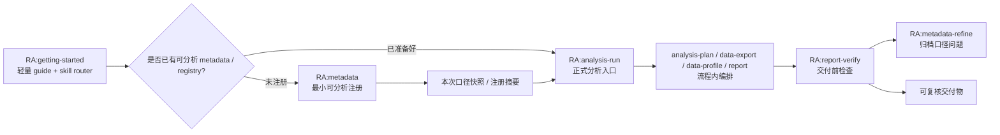

# RealAnalyst

**Metadata-first 分析执行系统。** 用 Metadata 管业务含义，用 Registry 管数据源可执行能力，用 Job 记录单次分析证据链——让 LLM 在可控边界内完成从问题到报告，并把口径缺口反哺回长期资产。

核心能力由 skills 驱动，可被 CLI、MCP、企业 agent workflow 或 BI workflow 复用。

## 三个 Core

| Core | 管什么 | 不管什么 |
| --- | --- | --- |
| Metadata Core | 字段、指标、术语、业务定义、证据引用、index/context | 不保存运行态枚举、sample profile、单次报告结论 |
| Runtime Registry Core | Tableau / DuckDB / CSV 等 source 的可执行能力、字段、filter、parameter、source group | 不承担业务定义真源 |
| Job Core | 本次分析实际使用的数据、plan、profile、analysis、report、verification、feedback、artifact index | 不承担长期任务管理 |

核心边界：Metadata 管“含义”，Registry 管“能不能取”，Job 管“这次实际用了什么”。LLM 负责组织、推断、解释和编排；事实状态由三核承接，不由聊天记忆承接。

## 用户入口

普通用户先记 3 个：

| 你想做什么 | 入口 |
| --- | --- |
| 不知道从哪里开始 | `/skill RA:getting-started` |
| 注册/维护数据源、字段、指标、口径 | `/skill RA:metadata` |
| 数据已准备好，进入正式完整分析 | `/skill RA:analysis-run` |

常见补充入口：

| 你想做什么 | 入口 |
| --- | --- |
| 查看数据集长期口径说明 | `/skill RA:metadata-report` |
| 分析结束后归档口径问题 | `/skill RA:metadata-refine` |
| 检查已有报告是否可交付 | `/skill RA:report-verify` |

流程内 skill（`RA:analysis-plan`、`RA:data-export`、`RA:data-profile`、`RA:report`）通常由 `RA:analysis-run` 编排，不需要手动调用。

## 首次成功路径

| 步骤 | 用户动作 | 产物 |
| --- | --- | --- |
| 1 | 提供数据集、字段清单、业务文档或口径说明 | 原始证据进入 `metadata/sources/` |
| 2 | 注册字段、指标、术语、筛选器和业务口径 | `metadata/dictionaries/`、`metadata/mappings/`、`metadata/datasets/` |
| 3 | 生成本轮分析需要的 semantic context | metadata index / catalog / context |
| 4 | 基于 context 生成分析计划并确认 | `analysis_plan.md` |
| 5 | 执行取数、画像、分析、报告和校验 | CSV、profile、report、verification |

> 步骤2的层级对应：字段定义 / 指标 / 术语 → `metadata/dictionaries/`；字段与数据源的对应关系 → `metadata/mappings/`；一个真实可分析的数据集 → `metadata/datasets/`。

## 适用场景与解决的问题

| 场景 / 问题 | RealAnalyst 的处理方式 |
| --- | --- |
| 同一指标多套口径 | 把指标定义、证据、review 状态写进 metadata，沉淀成稳定术语体系 |
| Tableau 字段名和导出 token 对不上 | 用 runtime registry 记录真实可用字段、filter、parameter 和 source group |
| Agent 一上来就取数 | 先生成分析计划，确认数据源、维度、指标和限制，再执行 |
| 报告结论无法追溯 | 每次导出、画像、报告和验证都写入同一个 job |
| 业务同学需要快速分析 | Agent 基于已确认语义完成一次可复核分析 |
| 接入企业智能体空间 | 把语义注册、分析执行、报告校验当作分析 harness 接入 workflow |

## 一次完整流程

数据源未注册时先走 `RA:metadata` 做最小可分析注册，再进入 `RA:analysis-run`。分析中发现口径问题不中断，只记录到 job feedback；正式写回 metadata 需用户主动进入 `RA:metadata-refine`。

更多架构图见 [docs/architecture.md](docs/architecture.md)。Skill 调用关系见 [docs/skill-interaction-design.md](docs/skill-interaction-design.md)。

## 安装

详见 [INSTALL.md](INSTALL.md)。

## Skill 能力一览

| 能力 | 业务意义 | Skill |
| --- | --- | --- |
| 元数据维护 | 把字段、指标、口径、证据和 review 状态沉淀成长期资产 | `RA:metadata` |
| 分析编排 | 把计划、取数、画像、报告串成一次可复核 job | `RA:analysis-run` |
| 受控取数 | 从 Tableau / DuckDB 导出可追溯 CSV | `RA:data-export` |
| 数据画像 | 检查缺失、异常、分布和字段类型 | `RA:data-profile` |
| 报告生成 | 输出带证据和口径说明的 Markdown 报告 | `RA:report` |
| 交付检查 | 检查结论、数据来源和待复核项 | `RA:report-verify` |
| 口径归档 | 把分析反馈和真实数据探查写回 metadata | `RA:metadata-refine` |
| 元数据报告 | 数据集长期口径说明和 review gap 报告 | `RA:metadata-report` |
| 元数据检索 | 按关键词检索字段、指标、术语和数据集 | `RA:metadata-search` |
| 数据融合 | 合并多数据源产物并记录血缘 | `RA:artifact-fusion` |

### 产物归属

| 产物 | Owner skill |
| --- | --- |
| metadata YAML / index / context / registry sync | `RA:metadata` |
| metadata Markdown report | `RA:metadata-report` |
| CSV / export_summary / acquisition_log | `RA:data-export` |
| `profile/manifest.json` + `profile/profile.json` | `RA:data-profile` |
| `analysis.json` / `analysis_journal` | `RA:analysis-run` |
| 业务报告 Markdown | `RA:report` |
| `verification.json` | `RA:report-verify` |
| refine reference pack | `RA:metadata-refine` |

## 分层设计

| 层级 | 路径 / 产物 | 作用 |
| --- | --- | --- |
| sources | `metadata/sources/` | 原始证据、connector discovery 归档、用户文档 |
| dictionaries | `metadata/dictionaries/` | 公共指标、维度、术语 |
| mappings | `metadata/mappings/` | source 字段到标准语义的映射 |
| datasets | `metadata/datasets/` | 一个真实可分析对象一份 YAML |
| index | `metadata/index/` | JSONL + FTS5 `search.db` 检索索引 |
| context | metadata context pack | 本轮分析需要的最小语义上下文 |
| registry | `runtime/registry.db` | 运行时 source、lookup tables、source groups |
| jobs | `jobs/{SESSION_ID}/` | 单次分析的 CSV、profile、analysis、report、verification |

## 项目里有哪些东西

| 路径 | 给业务读者的解释 |
| --- | --- |
| `metadata/` | 数据集、字段、指标和业务口径说明 |
| `runtime/` | 程序执行时需要的 source、registry 和示例配置 |
| `skills/` | 可调用的分析能力（skills 驱动） |
| `examples/` | 脱敏 demo 数据和本地跑通脚本 |
| `schemas/` | 结构化产物的 JSON Schema 契约 |
| `docs/` | 更详细的流程、目录和验证说明 |
| `jobs/` | 每次分析运行的本地产物，默认不提交 |

更多目录说明见 [docs/repository-layout.md](docs/repository-layout.md)。文档索引见 [docs/README.md](docs/README.md)。

## 公开仓库边界

公开仓库只应该保留 demo、example 和不含敏感信息的说明文档。

不要提交：

- `.env`、token、password、PAT secret
- `*.duckdb`、`*.db`、`registry.db`
- 真实 Tableau workbook / field / filter 快照
- `jobs/`、`logs/`、临时导出 CSV
- `metadata/index/`、`metadata/osi/` 这类可重新生成的产物

`.gitignore` 已经覆盖这些路径。提交前仍建议看一眼 `git status --ignored`。

## 使用边界

| 情况 | 建议 |
| --- | --- |
| 临时查一条 SQL | 直接使用 DuckDB CLI 或已有 BI 工具 |
| 缺少字段含义和指标口径 | 先用 `RA:metadata` 注册术语和语义上下文 |
| 需要稳定报告和复核链路 | 使用 `RA:analysis-run` 完成 plan、export、profile、report、verify |
| 需要接入企业智能体空间 | 把 RealAnalyst skills 和 runtime support 当作分析 harness 接入 workflow |

## 适合什么团队

RealAnalyst 更适合经常做经营分析、指标解释、数据复核和管理层报告的团队。它不会替代业务判断，也不会自动保证指标就是对的；它的价值是把“判断依据”摆到台面上，让人和 Agent 都围绕同一套口径工作。

如果你的分析任务需要解释字段、引用口径、复核数据来源，RealAnalyst 会比裸写 SQL 或直接让 Agent 读表更稳。

## 版本说明

**当前版本：0.3.16**（2026-05-08）

完整变更历史见 [CHANGELOG.md](CHANGELOG.md)。发布前验证记录见 [docs/validation-report.md](docs/validation-report.md)。
