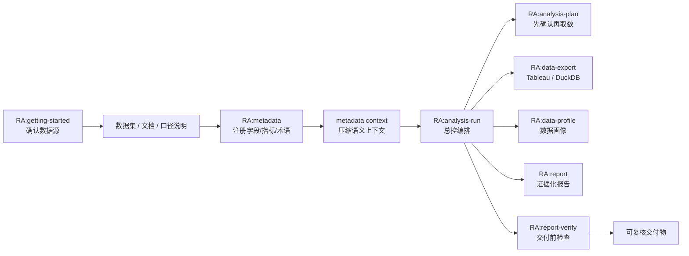
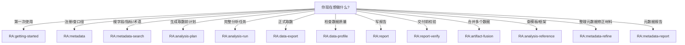

# RealAnalyst


RealAnalyst 是一个轻量的语义分析 harness：先把业务字段和指标的含义注册成可检索的 metadata，再让 AI Agent 基于这套口径做受控分析和报告。不需要 Agent 每次都解释背景，不需要人工盯着每条 SQL。

## 项目语义

| 项 | 定义 |
| --- | --- |
| 项目类型 | 轻量、可插拔的语义分析 harness |
| 目标用户 | 分析师、懂分析的业务同学、企业智能体团队、BI / 数据平台团队 |
| 核心输入 | 数据集、字段清单、Tableau / DuckDB source、业务文档、口径说明 |
| 语义资产 | 字段、指标、术语、筛选器、证据、review 状态、数据集适用边界 |
| 执行方式 | Codex skills + metadata YAML + runtime registry + job artifacts |
| 核心输出 | metadata context、分析计划、受控 CSV、数据画像、证据化报告、verification |
| 集成位置 | Codex 项目内、团队 marketplace、企业 agent workflow / harness |

## 首次成功路径

| 步骤 | 用户动作 | 产物 |
| --- | --- | --- |
| 1 | 提供数据集、字段清单、业务文档或口径说明 | 原始证据进入 `metadata/sources/` |
| 2 | 注册字段、指标、术语、筛选器和业务口径 | `metadata/dictionaries/`、`metadata/mappings/`、`metadata/datasets/` |
| 3 | 生成本轮分析需要的 semantic context | metadata index / catalog / context |
| 4 | 基于 context 生成分析计划并确认 | `analysis_plan.md` |
| 5 | 执行取数、画像、分析、报告和校验 | CSV、profile、report、verification |

> 步骤2的层级对应：字段定义 / 指标 / 术语 → `metadata/dictionaries/`；字段与数据源的对应关系 → `metadata/mappings/`；一个真实可分析的数据集 → `metadata/datasets/`。

## 适用场景

| 场景 | RealAnalyst 提供的能力 |
| --- | --- |
| 分析师维护高频数据集 | 把字段、指标和口径沉淀成稳定术语体系 |
| 业务同学快速分析 | 让 Agent 基于已确认语义完成一次分析 |
| 企业智能体空间 | 把语义注册、分析执行、报告校验接入 agent workflow |
| Tableau / DuckDB 分析 | 用 runtime registry 记录真实字段、filter、parameter 和 source group |
| 报告复核 | 把数据来源、口径状态、待确认项写进交付物 |

## 它解决什么问题

| 常见问题 | RealAnalyst 的处理方式 |
| --- | --- |
| 同一个指标有多个口径 | 把指标定义、证据、review 状态写进 metadata |
| Tableau 字段名和导出 token 对不上 | 用 runtime registry 记录真实可用字段、filter 和 parameter |
| Agent 一上来就取数 | 先生成分析计划，再确认数据源、维度、指标和限制 |
| 报告结论无法追溯 | 每次导出、画像、报告和验证都写入同一个 job |
| 公开仓库容易混入敏感数据 | 只提交 demo、example 和不含凭据的文档，真实运行产物默认忽略 |

## 一次完整流程



大多数业务分析从 `RA:analysis-run` 开始。只有明确需要维护 metadata、导出数据或检查报告时，才直接调用单个 skill。

更多架构图见 [docs/architecture.md](docs/architecture.md)。完整 skill 调用关系见 [docs/skill-interaction-design.md](docs/skill-interaction-design.md)。

## 安装和更新

### 团队 marketplace 方式

```bash
codex plugin marketplace add dabaige53/RealAnalyst --ref main
```

更新 marketplace 和插件缓存：

```bash
codex plugin marketplace upgrade realanalyst-marketplace
```

然后重启 Codex，在插件目录中启用 RealAnalyst。这个仓库已经提供 `.agents/plugins/marketplace.json`，Codex 会从 GitHub 读取该 marketplace，并把插件安装到本机 cache。

### 安装到当前 Codex 项目

```bash
curl -fsSL https://raw.githubusercontent.com/dabaige53/RealAnalyst/main/scripts/install_codex_plugin.py | python3 -
```

默认版本策略是 `latest`。安装器会把插件仓库保持在 `main` 最新状态。安装器会把策略写入 `~/plugins/realanalyst/.realanalyst-install.json`，以后重新运行安装命令时会沿用该策略。

安装脚本只写入插件相关文件：

- 注册当前项目的 `.agents/plugins/marketplace.json`
- 安装项目内 `.agents/skills/`
- 安装或更新项目内 `runtime/` 执行支持文件（不复制 `registry.db`、缓存或本地生成数据）
- 初始化插件目录里的 `~/plugins/realanalyst/.env`，已有则保留

安装脚本不会创建 `metadata/`、`jobs/`、`logs/`，不会写当前项目的 `.env` / `.gitignore`，也不会写入 demo 数据或真实 registry。只有用户确认要保存抽取结果或执行分析产物时，RealAnalyst 才会按需创建业务工作区文件夹。

### 更新已安装的 RealAnalyst

已经装过且版本策略是 `latest` 时，直接在目标项目里重新执行同一条命令即可。安装脚本会更新 `~/plugins/realanalyst`，保留已有 `.env`，并刷新当前项目的 `.agents/skills/` 和 `runtime/` 支持文件：

```bash
curl -fsSL https://raw.githubusercontent.com/dabaige53/RealAnalyst/main/scripts/install_codex_plugin.py | python3 -
```

锁定固定版本：

```bash
curl -fsSL https://raw.githubusercontent.com/dabaige53/RealAnalyst/main/scripts/install_codex_plugin.py | python3 - --version 0.3.11
```

切回自动跟随最新：

```bash
curl -fsSL https://raw.githubusercontent.com/dabaige53/RealAnalyst/main/scripts/install_codex_plugin.py | python3 - --version latest
```

更新其他项目：

```bash
curl -fsSL https://raw.githubusercontent.com/dabaige53/RealAnalyst/main/scripts/install_codex_plugin.py | python3 - --project /path/to/your/project
```

只更新插件仓库和 marketplace，不覆盖项目内 `.agents/skills/`：

```bash
curl -fsSL https://raw.githubusercontent.com/dabaige53/RealAnalyst/main/scripts/install_codex_plugin.py | python3 - --skip-project-skills
```

全局启用或更新：

```bash
curl -fsSL https://raw.githubusercontent.com/dabaige53/RealAnalyst/main/scripts/install_codex_plugin.py | python3 - --global
```

更新后重启 Codex，再使用 `RA:` 前缀的 skill 名称。

### 开始使用

安装后的 LLM 引导读线上文档：[docs/llm-next-steps.md](https://raw.githubusercontent.com/dabaige53/RealAnalyst/main/docs/llm-next-steps.md)。不要把引导文件写进用户项目。

安装完成后重启 Codex，直接从初始引导开始：

```text
/skill RA:getting-started
帮我确认数据源类型，并列出抽取元数据前需要准备的信息。
```

如果你想让 LLM / Codex 代为安装和启动，把下面这段完整指令发给它：

```text
请在当前项目内安装 RealAnalyst Codex 插件，只在当前项目启用，不要全局启用。直接执行：

curl -fsSL https://raw.githubusercontent.com/dabaige53/RealAnalyst/main/scripts/install_codex_plugin.py | python3 -

安装完成后检查当前项目的 .agents/plugins/marketplace.json 是否已包含 realanalyst，并告诉我是否成功。
同时检查当前项目的 .agents/skills/ 是否已安装 RealAnalyst skills，并确认 runtime support 已安装到当前项目的 runtime/。不要创建 metadata、jobs、logs 或其他业务工作区文件夹。
读取 https://raw.githubusercontent.com/dabaige53/RealAnalyst/main/docs/llm-next-steps.md，并按里面的步骤引导我下一步。
```

如果当前项目已经安装过 RealAnalyst，需要按最新架构整理旧内容，把下面这段发给 LLM / Codex：

```text
读取 https://raw.githubusercontent.com/dabaige53/RealAnalyst/main/docs/update-guide.md，按里面的步骤先更新 RealAnalyst 插件本体，再逐层检查和更新当前项目的元数据、索引、运行时、skill 能力和文档，使其完全适配最新架构。RealAnalyst 架构文档以线上或 ~/plugins/realanalyst/ 为准，不要要求当前业务项目拥有完整仓库 README/docs。每完成一步告诉我结果，缺失项引导我补充。
```

预期成功输出类似：

```text
Installed RealAnalyst for Codex.
Requested version: (saved strategy or latest)
Resolved version strategy: latest
Installed plugin version: 0.3.11
Installed plugin commit: <git-commit>
Enabled marketplace: /your/project/.agents/plugins/marketplace.json
Plugin env file: /Users/you/plugins/realanalyst/.env
Online LLM guide: https://raw.githubusercontent.com/dabaige53/RealAnalyst/main/docs/llm-next-steps.md
Online update guide: https://raw.githubusercontent.com/dabaige53/RealAnalyst/main/docs/update-guide.md
Installed skills: /your/project/.agents/skills
Project skills status:
  - metadata: replaced (RealAnalyst marker present)
Installed runtime support: /your/project/runtime
No jobs/logs/business workspace folders were created.
Restart Codex, then run:
/skill RA:getting-started
```

更多安装说明见 [INSTALL.md](INSTALL.md)。

## 快速体验

仓库里带了一套脱敏 demo，可以不用连接真实 Tableau，先跑通 DuckDB 示例。

```bash
python3 -m venv .venv
source .venv/bin/activate
pip install -r requirements.txt
```

构建 demo DuckDB 并注册 source：

```bash
python3 examples/build_demo_duckdb.py
python3 runtime/duckdb/register_duckdb_sources.py
```

校验 demo metadata 并跑导出测试：

```bash
python3 skills/metadata/scripts/metadata.py validate
python3 skills/data-export/scripts/duckdb/run_tests.py
```

成功后，你会看到 demo source 被注册，并在 `jobs/data-export-duckdb-tests/` 下生成测试导出结果。`jobs/` 和 demo `.duckdb` 是本地运行产物，不会提交到公开仓库。

## 在 Codex 里怎么开始

### Skill 路由



### 快捷入口

第一次使用：

```text
/skill RA:getting-started
帮我确认数据源类型，并列出抽取元数据前需要准备的信息。
```

注册数据集或业务文档：

```text
/skill RA:metadata
帮我把这个数据集或文档注册成术语体系，并维护字段、指标、筛选器和业务口径。
```

已有 metadata 后：

```text
/skill RA:analysis-run
基于现有 metadata context，帮我生成分析计划，确认后再执行取数、画像、分析和报告。
```

只想维护数据源和口径：

```text
/skill RA:metadata
帮我注册一个数据集，并维护字段、指标、筛选器和业务口径。
```

## 主要能力

| 能力 | 业务上意味着什么 | 主要入口 |
| --- | --- | --- |
| 初始引导 | 第一次使用时确认数据源类型和准备清单 | `RA:getting-started` |
| 元数据维护 | 把字段、指标、口径、证据和 review 状态沉淀下来 | `RA:metadata` |
| 元数据检索 | 按关键词检索 metadata index 和数据集目录 | `RA:metadata-search` |
| 元数据修正材料 | 把分析反馈、用户问题和真实数据探查整理成可引用材料 | `RA:metadata-refine` |
| 分析计划 | 取数前先确认问题、指标、维度和限制 | `RA:analysis-plan` |
| 分析编排 | 把计划、取数、画像、报告串成一次 job | `RA:analysis-run` |
| 受控取数 | 从 Tableau / DuckDB 导出可追溯 CSV | `RA:data-export` |
| 数据画像 | 检查缺失、异常、分布和字段类型 | `RA:data-profile` |
| 报告生成 | 输出带证据和口径说明的 Markdown 报告 | `RA:report` |
| 交付检查 | 检查结论、数据来源和待复核项 | `RA:report-verify` |
| 数据融合 | 合并多个数据源产物并记录血缘 | `RA:artifact-fusion` |
| 模板/框架查询 | 按需查报告模板和分析框架定义 | `RA:analysis-reference` |
| 元数据报告 | 生成数据源注册说明、metadata report 和 review gap 报告 | `RA:metadata-report` |

### 产物归属

| 产物 | Owner skill |
| --- | --- |
| metadata YAML / index / context / registry sync | `RA:metadata` |
| metadata Markdown report | `RA:metadata-report` |
| CSV / export_summary / acquisition_log | `RA:data-export` |
| `profile/manifest.json` + `profile/profile.json` | `RA:data-profile` |
| `analysis.json` / `analysis_journal` | `RA:analysis-run` |
| 业务报告 Markdown | `RA:report` |
| `verification.json` | `RA:report-verify` |
| refine reference pack | `RA:metadata-refine` |

## 分层设计

| 层级 | 路径 / 产物 | 作用 |
| --- | --- | --- |
| sources | `metadata/sources/` | 原始证据、connector discovery 归档、用户文档 |
| dictionaries | `metadata/dictionaries/` | 公共指标、维度、术语 |
| mappings | `metadata/mappings/` | source 字段到标准语义的映射 |
| datasets | `metadata/datasets/` | 一个真实可分析对象一份 YAML |
| index | `metadata/index/` | JSONL + FTS5 `search.db` 检索索引 |
| context | metadata context pack | 本轮分析需要的最小语义上下文 |
| registry | `runtime/registry.db` | 运行时 source、lookup tables、source groups |
| jobs | `jobs/{SESSION_ID}/` | 单次分析的 CSV、profile、analysis、report、verification |

## 项目里有哪些东西

| 路径 | 给业务读者的解释 |
| --- | --- |
| `metadata/` | 数据集、字段、指标和业务口径说明 |
| `runtime/` | 程序执行时需要的 source、registry 和示例配置 |
| `skills/` | Codex 可调用的分析能力 |
| `examples/` | 脱敏 demo 数据和本地跑通脚本 |
| `schemas/` | 结构化产物的 JSON Schema 契约 |
| `docs/` | 更详细的流程、目录和验证说明 |
| `jobs/` | 每次分析运行的本地产物，默认不提交 |

更多目录说明见 [docs/repository-layout.md](docs/repository-layout.md)。文档索引见 [docs/README.md](docs/README.md)。

## 公开仓库边界

公开仓库只应该保留 demo、example 和不含敏感信息的说明文档。

不要提交：

- `.env`、token、password、PAT secret
- `*.duckdb`、`*.db`、`registry.db`
- 真实 Tableau workbook / field / filter 快照
- `jobs/`、`logs/`、临时导出 CSV
- `metadata/index/`、`metadata/osi/` 这类可重新生成的产物

`.gitignore` 已经覆盖这些路径。提交前仍建议看一眼 `git status --ignored`。

## 使用边界

| 情况 | 建议 |
| --- | --- |
| 临时查一条 SQL | 直接使用 DuckDB CLI 或已有 BI 工具 |
| 缺少字段含义和指标口径 | 先用 `RA:metadata` 注册术语和语义上下文 |
| 需要稳定报告和复核链路 | 使用 `RA:analysis-run` 完成 plan、export、profile、report、verify |
| 需要接入企业智能体空间 | 把 RealAnalyst skills 和 runtime support 当作分析 harness 接入 workflow |

## 适合什么团队

RealAnalyst 更适合经常做经营分析、指标解释、数据复核和管理层报告的团队。它不会替代业务判断，也不会自动保证指标就是对的；它的价值是把“判断依据”摆到台面上，让人和 Agent 都围绕同一套口径工作。

如果你的分析任务需要解释字段、引用口径、复核数据来源，RealAnalyst 会比裸写 SQL 或直接让 Agent 读表更稳。

## 版本说明

**当前版本：0.3.11**（2026-05-06）

完整变更历史见 [CHANGELOG.md](CHANGELOG.md)。发布前验证记录见 [docs/validation-report.md](docs/validation-report.md)。
