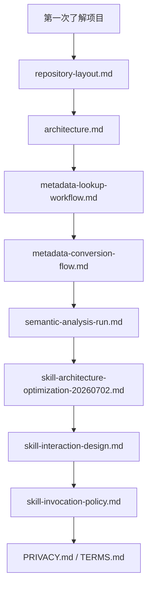

# Docs

这里是 RealAnalyst 的公开说明文档区。
如果你不是在执行某个具体 skill，而是想理解项目设计、目录边界、metadata 流程和分析链路，先从这里读。

---

## 推荐阅读顺序

---

## 文档索引

| 文件 | 适合谁读 | 解决什么问题 |
| --- | --- | --- |
| `repository-layout.md` | 所有用户 / 贡献者 | 解释每个目录放什么、谁维护、是否上传 |
| `metadata-lookup-workflow.md` | 分析师 / Agent builder | 解释为什么需求理解阶段先 search/context，而不是扫完整 YAML |
| `metadata-conversion-flow.md` | 贡献者 / 架构维护者 | 解释 YAML、index、context、registry、OSI 的转换关系 |
| `metadata-skill-consolidation.md` | 维护者 | 解释 metadata skill 为什么是统一入口 |
| `skill-architecture-optimization-20260702.md` | 维护者 / Agent builder | 解释 skills 从分散入口收敛到 active skillset、共享能力、探索流程和统一路由的优化方案 |
| `update-guide.md` | 用户 / LLM / Codex | 先更新插件本体，再按最新架构逐层检查和更新项目内容物 |
| `architecture.md` | 所有用户 / 贡献者 | 三核架构、文件职责、公开仓库边界 |
| `skill-interaction-design.md` | 维护者 / Agent builder | RealAnalyst active skills、legacy 兼容入口、数据契约和运行时序 |
| `skill-invocation-policy.md` | Agent builder / skill 维护者 | 规定什么时候自动调用、什么时候确认、什么时候只回答，避免误升级成正式分析或取数 |
| `skillset-audit-report.md` | 维护者 / 发布前检查者 | 记录本轮 skillset 填写、脚本、模板、交付物和流程完整性审查结论 |
| `semantic-analysis-run.md` | 分析师 / 产品经理 | 解释从 metadata 到报告验证的端到端链路 |
| `validation-report.md` | 维护者 / 发布前检查者 | 记录发布前验证结果、已知限制和复查建议 |
| `PRIVACY.md` | 用户 / 组织管理员 | 了解隐私边界 |
| `TERMS.md` | 用户 / 组织管理员 | 了解使用条款 |

---

## Docs 与 README 的区别

| 类型 | 读者 | 作用 |
| --- | --- | --- |
| 根目录 `README.md` | 第一次来的用户 | 快速知道项目是什么、怎么开始 |
| 各目录 `README.md` | 正在浏览某个目录的用户 | 解释这个目录该怎么用、不要做什么 |
| `docs/*.md` | 想理解设计的人 | 深入说明流程、边界和架构决策 |
| `skills/*/SKILL.md` | Codex / Agent | 执行规则、硬约束、脚本入口 |

---

## 后续可扩展文档

| 文档 | 内容 |
| --- | --- |
| `docs/quickstart.md` | 5 分钟 demo 路线、命令、预期输出 |
| `docs/job-lifecycle.md` | `jobs/{SESSION_ID}` 生命周期和文件关系图 |
| `docs/metadata-authoring-guide.md` | 如何从字段清单写成高质量 metadata YAML |
| `docs/report-quality-guide.md` | 好报告 / 差报告对照示例 |
