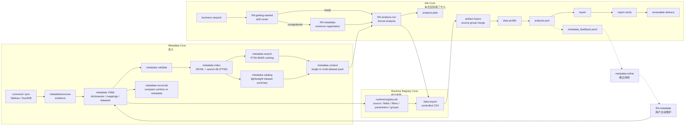
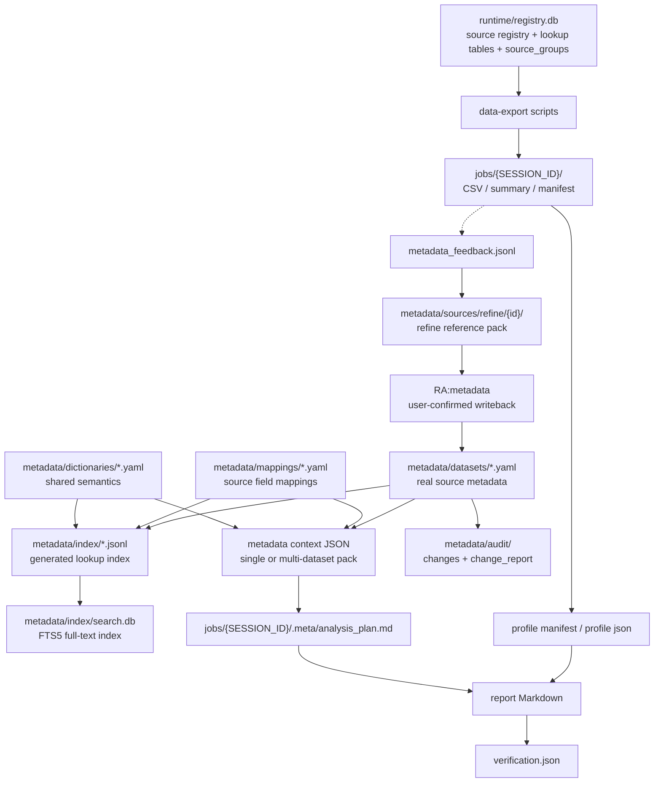
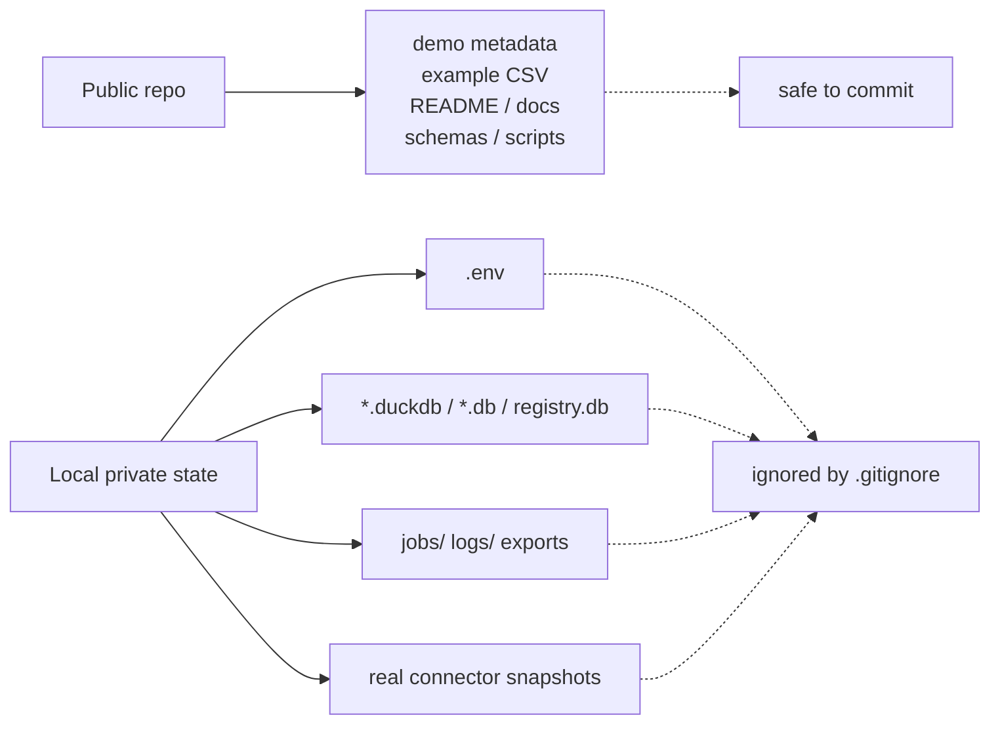

# Architecture

RealAnalyst 是平台无关的 metadata-first 分析执行系统。Codex skills 是当前第一套 adapter / entrypoint；核心能力由 Metadata Core、Runtime Registry Core 和 Job Core 承接，未来可以被 CLI、MCP、其他 LLM 产品、企业 agent workflow 或 BI workflow 复用。

## Three Core Model

| Core | 管什么 | 主要路径 |
| --- | --- | --- |
| Metadata Core | 业务含义、definition state、evidence relation、index/context builder | `metadata/`、`skills/metadata/`、`skills/metadata-search/` |
| Runtime Registry Core | source registry、connector metadata、filter / parameter / source group | `runtime/registry.db`、`runtime/`、`skills/data-export/` |
| Job Core | 单次分析状态、artifact index、feedback、verification artifacts | `jobs/{SESSION_ID}/`、`skills/analysis-run/`、`skills/report-verify/` |

核心边界：Metadata 管“含义”，Registry 管“能不能取”，Job 管“这次实际用了什么”。Report 是 `RA:analysis-run` 面向用户的最终交付，不是独立 core。Job 内部保留完整上下文，包括 plan、export、profile、analysis、verification、definition snapshot、feedback 和 artifact index。

LLM 负责组织、推断、解释和编排；事实状态由三核承接。LLM 可以起草定义、组织证据、生成计划、写报告、发现口径缺口和整理 refine 材料，但不能把推断定义直接标成事实，不能隐式写回正式 metadata，不能用聊天记忆替代 job artifacts。

长期任务管理不属于 Job Core；跨多天目标、阶段推进和用户意图演进交给外部 continuity layer。

## Core Flow

## File Responsibilities

`runtime/registry.db` 是唯一运行时 SQLite DB；其中 `source_groups` 管理 1 个 primary source 与最多 2 个 supplementary sources，供 `artifact-fusion` 做多源合并。

`metadata/audit/` 记录每次 YAML 维护的变更摘要、文件路径和证据，并可生成变更报告。

Dataset YAML 必须轻量：只放数据集身份、可分析字段/指标、边界和引用关系。profile、sample values、enum values、registry snapshot、report 结论和证据全文分别归到 `metadata/sources/`、`runtime/registry.db`、`metadata/audit/` 或 job artifacts，不回写到 dataset YAML。

`RA:metadata-refine` 只生成参考材料；正式 YAML 写回必须由用户主动进入 `RA:metadata`，并经过 validate / index / sync-registry。

## Public Repository Boundary

