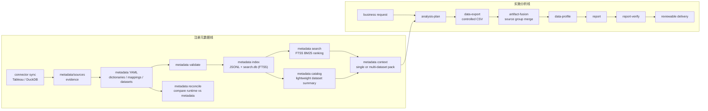
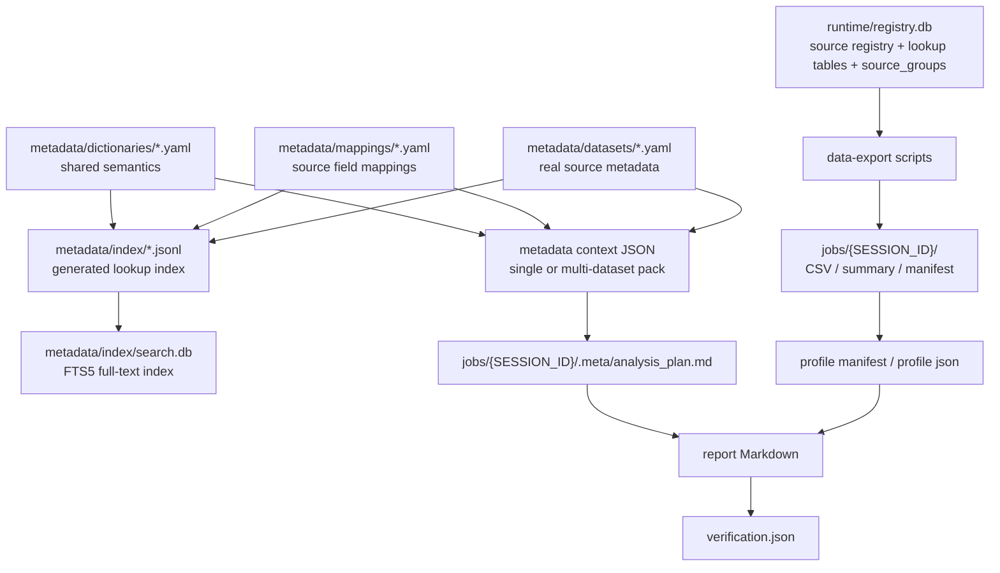
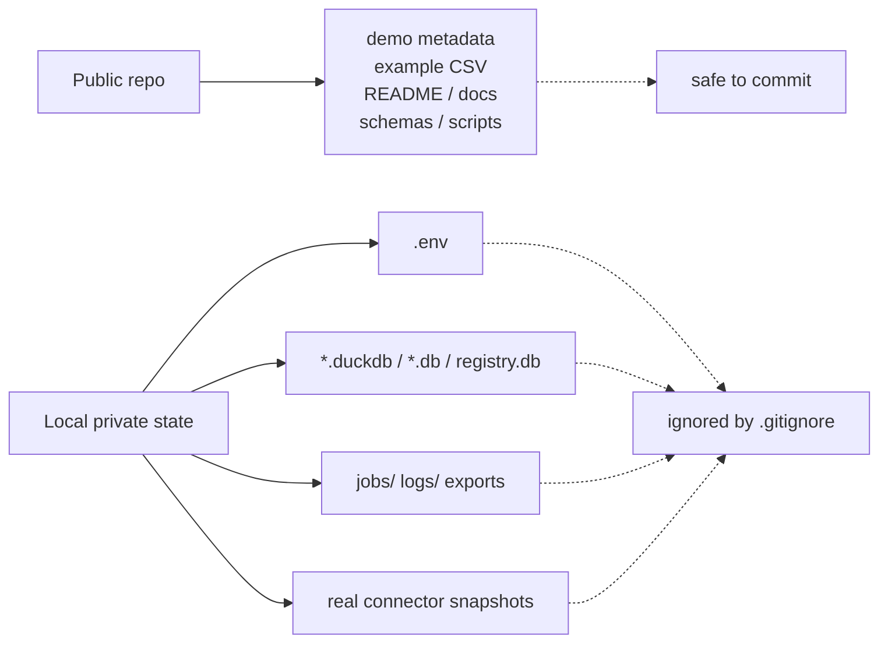

# Architecture

RealAnalyst 有两条主线：注册元数据线和实施分析线。前者把 Tableau / DuckDB 的 source facts 沉淀成可审查的 metadata；后者基于 metadata 完成 plan、export、profile、report 和 verify。

## Two Flow Lines

## File Responsibilities

`runtime/registry.db` 是唯一运行时 SQLite DB；其中 `source_groups` 管理 1 个 primary source 与最多 2 个 supplementary sources，供 `artifact-fusion` 做多源合并。

## Public Repository Boundary

