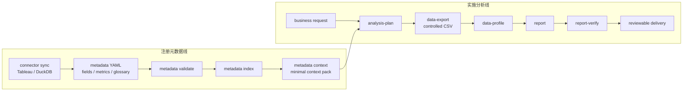
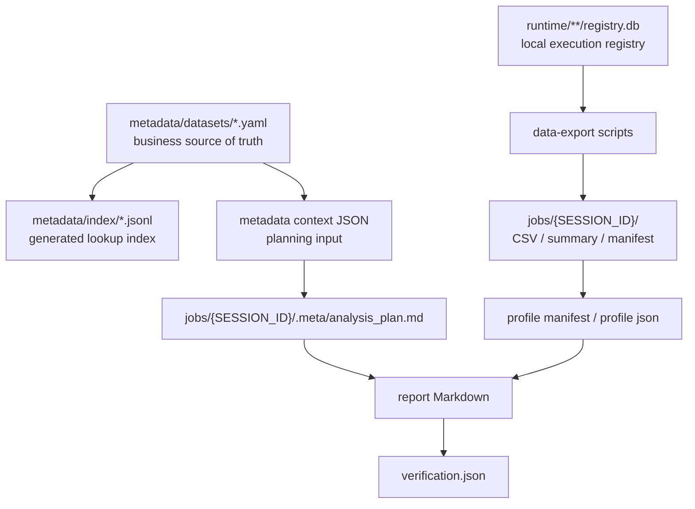
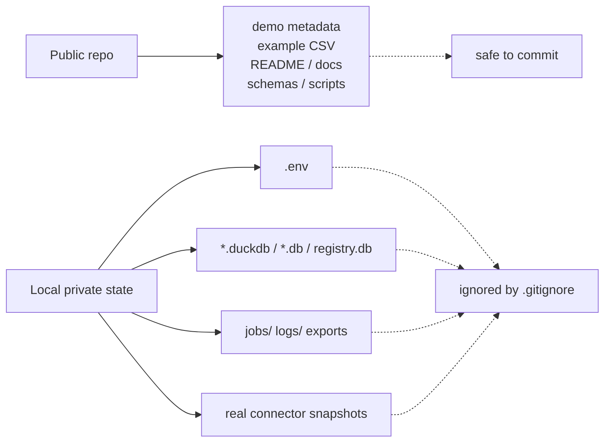

# Architecture

RealAnalyst 有两条主线：注册元数据线和实施分析线。前者把 Tableau / DuckDB 的 source facts 沉淀成可审查的 metadata；后者基于 metadata 完成 plan、export、profile、report 和 verify。

## Two Flow Lines

## File Responsibilities

## Public Repository Boundary

