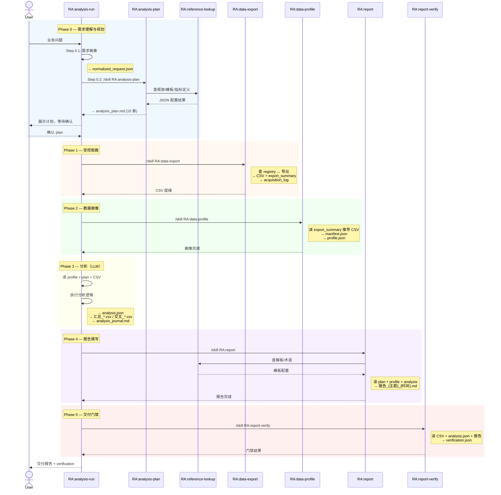
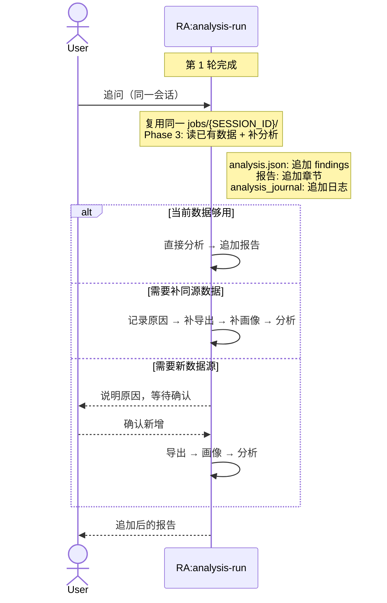
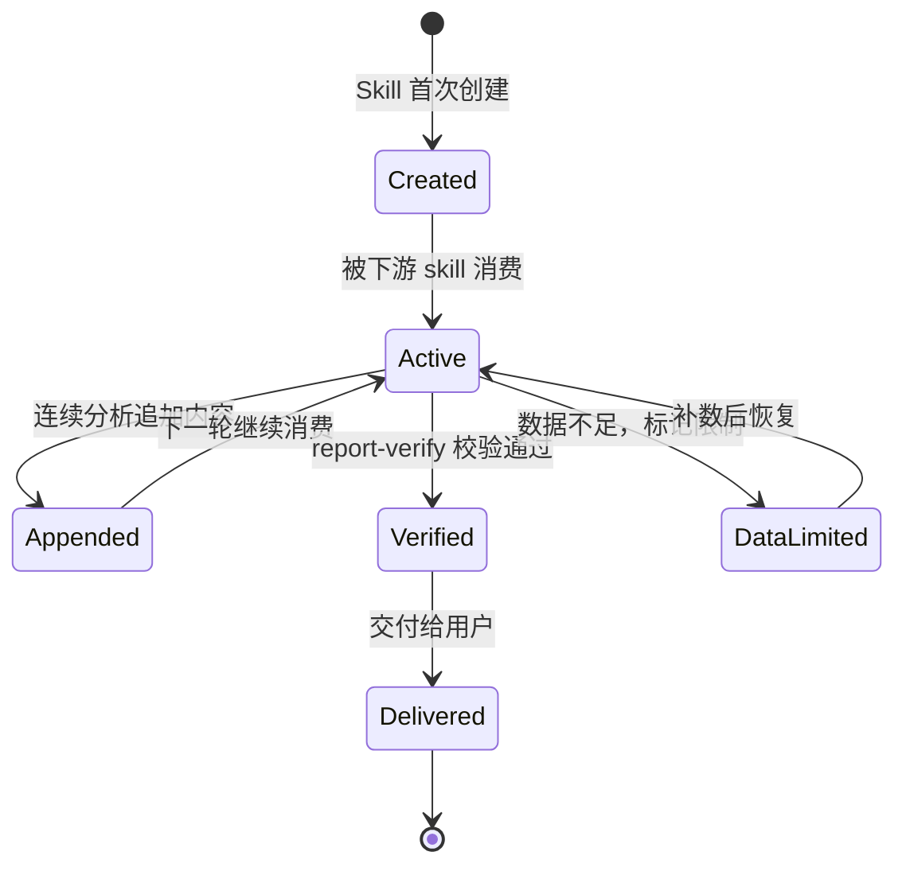

# RealAnalyst Skills 交互与产物详细设计

本文档描述 RealAnalyst 中 12 个 skill 之间的调用关系、数据传递契约、产物规范和运行时序。

---

## 目录

- [设计原则](#设计原则)
- [Skill 分类](#skill-分类)
- [主链路时序](#主链路时序)
- [每个 Skill 的详细接口](#每个-skill-的详细接口)
- [Skill 间数据契约](#skill-间数据契约)
- [连续分析（多轮）](#连续分析多轮)
- [辅助 Skill 触发条件](#辅助-skill-触发条件)
- [错误处理与降级](#错误处理与降级)
- [产物生命周期](#产物生命周期)

---

## 设计原则

| 原则 | 说明 |
| --- | --- |
| **总控编排** | `RA:analysis-run` 是唯一的编排器，按 Phase 0–5 调度其他 skill |
| **单 Session 单 Job** | 同一会话内只允许一个 `jobs/{SESSION_ID}/` 目录 |
| **Append-only** | 报告和 `analysis.json` 在连续分析中只追加不重写 |
| **产物路径从索引读取** | 禁止猜测文件名，必须从 `export_summary` / `artifact_index` 获取实际路径 |
| **用户确认先于执行** | Plan 确认、新增数据源确认、报告交付确认 — 至少保留一次停顿 |
| **Schema 驱动** | 所有结构化产物有 JSON Schema，skill 间通过 schema 约定数据格式 |

---

## Skill 分类

### 主链路（按执行顺序）

```
getting-started → metadata → analysis-run
                                ├── analysis-plan   (Phase 0)
                                ├── data-export     (Phase 1)
                                ├── data-profile    (Phase 2)
                                ├── [LLM 分析]      (Phase 3)
                                ├── report          (Phase 4)
                                └── report-verify   (Phase 5)
```

### 辅助

| Skill | 角色 | 触发时机 |
| --- | --- | --- |
| `reference-lookup` | 内部工具 | analysis-plan 选框架/模板时；report 查术语时 |
| `artifact-fusion` | 可选步骤 | source group 内多源合并，在 data-export 后、data-profile 前 |
| `metadata-report` | 独立功能 | 用户需要生成元数据审阅报告时 |

---

## 主链路时序

### 完整流程（单轮）



### 连续分析（多轮追问）



---

## 每个 Skill 的详细接口

### RA:getting-started

| 项目 | 说明 |
| --- | --- |
| **触发条件** | 首次使用、不知道准备什么、想确认数据源类型 |
| **输入** | 用户口述的数据源描述 |
| **输出** | 准备清单（字段、指标、筛选器、证据、待确认项） |
| **下游** | `RA:metadata`（注册）或 `RA:analysis-run`（直接分析） |
| **脚本** | 无（纯对话引导） |

### RA:metadata

| 项目 | 说明 |
| --- | --- |
| **触发条件** | 注册数据集、维护字段/指标/术语、生成 context、Tableau/DuckDB onboarding |
| **输入** | dataset YAML、source evidence、关键词、`metadata/sources/refine/{refine_id}/` 参考材料 |
| **输出** | validate 结果、index JSONL、search 结果、context pack |
| **下游** | `RA:analysis-plan`（via context pack）、`RA:data-export`（via registry） |
| **核心脚本** | `skills/metadata/scripts/metadata.py {validate,index,search,context}` |
| **分层** | sources → dictionaries → mappings → datasets → index/context → registry |

**关键产物**：

| 产物 | 路径 | 用途 |
| --- | --- | --- |
| validate 结果 | stdout JSON | 检查 YAML 是否满足字段、指标、证据、review 契约 |
| index | `metadata/index/*.jsonl` | 低 token 检索（analysis-plan 用） |
| context pack | `metadata/osi/<dataset_id>/context.md` | 给 analysis-plan 的最小上下文 |
| registry sync | `runtime/registry.db` | data-export 的数据源注册表与运行时 lookup tables |

### RA:metadata-refine

| 项目 | 说明 |
| --- | --- |
| **触发条件** | 分析 job 或用户反馈暴露字段定义、指标口径、证据不足、真实数据与 YAML 不一致 |
| **输入** | `metadata_feedback.jsonl`、profile、正式 CSV、用户反馈 |
| **输出** | `metadata/sources/refine/{refine_id}/` 参考材料，包含 `refine_followup.md` |
| **下游** | `RA:metadata` 基于参考材料修正式 YAML |
| **核心脚本** | `skills/metadata-refine/scripts/{collect_feedback,probe_data,build_reference_pack,archive_reference_pack}.py` |

`RA:metadata-refine` 不直接改 YAML，不同步 registry；分析流程只把问题记录到 job，再由 refine 生成参考材料。

### RA:analysis-plan

| 项目 | 说明 |
| --- | --- |
| **触发条件** | 取数前需要正式计划；analysis-run Step 0.2 自动调用 |
| **输入** | `normalized_request.json` + metadata context pack |
| **输出** | `.meta/analysis_plan.md`（10 章） |
| **下游** | analysis-run（Phase 1+）、report |
| **依赖** | `RA:reference-lookup`（查框架、模板、指标） |

**10 章输出规范**：

1. 数据源概述
2. 场景分类（monitoring / diagnosis / benchmark / ...）
3. 业务假设清单
4. 异常判定标准
5. 下钻路径设计
6. 框架选择（via reference-lookup）
7. 目标拆解（goals + artifacts）
8. 报告模板锁定（selected_report_template）
9. 数据采集方案
10. 质量检查点

**降级处理**：

- 在 `RA:analysis-run` 编排下：`normalized_request.json` 不存在时报错终止
- 独立调用时：向用户追问 5 项必填信息 → 自行生成最小版 `normalized_request.json`

### RA:analysis-run

| 项目 | 说明 |
| --- | --- |
| **触发条件** | 完整分析任务（大多数用户入口） |
| **输入** | 用户问题 + 已注册 metadata |
| **输出** | 完整 job 目录 |
| **角色** | **总控编排器** — 自身不做取数/画像/报告，而是调度其他 skill |

**Phase 分解**：

| Phase | 动作 | 调用 Skill | 产出 |
| --- | --- | --- | --- |
| 0.1 | 需求画像 | （自身） | `normalized_request.json` |
| 0.2 | 分析规划 | `RA:analysis-plan` | `analysis_plan.md` |
| 1 | 受控取数 | `RA:data-export` | CSV + export_summary + acquisition_log |
| 2 | 数据画像 | `RA:data-profile` | manifest.json + profile.json |
| 3 | LLM 分析 | （自身） | `analysis.json` + 汇总/交叉 CSV + journal |
| 4 | 报告撰写 | `RA:report` | `报告_{主题}_{时间}.md` |
| 5 | 交付门禁 | `RA:report-verify` | `verification.json` |

**硬约束**：
- 一会话一 job
- 报告只追加不重写
- 至少一次用户确认停顿
- 禁止默认任何行业/公司/主体

### RA:data-export

| 项目 | 说明 |
| --- | --- |
| **触发条件** | 已锁定 source，需要正式导出 |
| **输入** | registry source id + filters/fields + SESSION_ID |
| **输出** | 见下表 |
| **上游** | analysis-run Phase 1、metadata（registry） |
| **下游** | data-profile（via export_summary → CSV 路径） |

**Tableau vs DuckDB 产物对比**：

| 产物 | Tableau | DuckDB |
| --- | --- | --- |
| 正式 CSV | `data/交叉_<source>.csv` | `data/<output-name>.csv` |
| 导出摘要 | `export_summary.json` | `duckdb_export_summary.json` |
| 语义上下文 | `source_context.json` ✅ | ❌ 不生成（用 metadata context pack 替代） |
| 上下文注入 | `context_injection.md` ✅ | ❌ 不生成 |
| 审计日志 | `acquisition_log.jsonl` | `acquisition_log.jsonl` |
| 产物索引 | `artifact_index.json` | `artifact_index.json` |

### RA:data-profile

| 项目 | 说明 |
| --- | --- |
| **触发条件** | 导出数据后，分析前做画像 |
| **输入** | 正式 CSV（从 export_summary 自动推导） |
| **输出** | `profile/manifest.json` + `profile/profile.json` |
| **上游** | data-export |
| **下游** | analysis-run Phase 3、report |

**manifest.json 内容**：schema、列名映射、lineage、profile_summary

**profile.json 内容**：字段语义角色（metric/dimension）、基数、缺失率、分布信号、质量评分

### RA:report

| 项目 | 说明 |
| --- | --- |
| **触发条件** | 分析完成后写报告 |
| **输入** | analysis_plan.md + profile + analysis + artifact_index + 各种 summary |
| **输出** | `报告_{主题}_{时间}.md` |
| **上游** | analysis-run Phase 4 |
| **下游** | report-verify |
| **依赖** | `RA:reference-lookup`（查模板/术语） |

**报告必备章节**：
- 任务背景
- 需求时间线
- 报告更新时间线
- 数据来源（位于报告上方）
- 阶段性结论
- 输出文件清单
- 口径说明（本次新增/临时）附录
- 阅读提示 / 注意事项
- 一段话结论
- 假设验证章节

**硬约束**：追加写作（不重写）、模板以 plan 锁定结果为准、禁止报告阶段重新选模板。

### RA:report-verify

| 项目 | 说明 |
| --- | --- |
| **触发条件** | 报告交付前做质量门禁 |
| **输入** | `data.csv` + `analysis.json` + `report.md` |
| **输出** | `verification.json` |
| **上游** | report + analysis-run Phase 3 + data-export |

**10 项检查**：

| 检查 | 说明 |
| --- | --- |
| evidence_completeness | 每个 finding 必须有 evidence |
| ranking_consistency | Top/Bottom 声明与 statistics 对齐 |
| trend_consistency | 增长/下降与 trend_label 对齐 |
| numeric_traceability | 报告中大数字可追溯到 analysis.json 或 CSV |
| confidence_threshold | 低置信度 finding 标记为 warning |
| metric_definition_appendix | 报告包含口径说明附录 |
| metric_term_consistency | 指标命名与数据字段一致 |
| data_source_section_position | "数据来源"章节位于报告上方 |
| data_source_display_name | 数据源展示用中文名 |
| output_file_list_section | 报告包含输出文件清单 |

**verification.json 结构** (遵循 `schemas/verification.schema.json`)：

```json
{
  "job_id": "...",
  "verified_at": "ISO 8601",
  "status": "passed | failed | warning",
  "checks": [...],
  "summary": {
    "total_checks": 15,
    "passed": 12,
    "failed": 2,
    "warnings": 1
  }
}
```

### RA:artifact-fusion

| 项目 | 说明 |
| --- | --- |
| **触发条件** | source group 内多次 export 完成后，需要合并数据集 |
| **输入** | 多个输入目录（含 CSV + manifest） |
| **输出** | 合并 CSV + lineage manifest |
| **上游** | data-export（多次导出后） |
| **下游** | data-profile → 继续分析 |

**三种策略**：

| 策略 | 说明 | 注意事项 |
| --- | --- | --- |
| `union` | 纵向拼接（schema 相同） | 自动对齐列名 |
| `join` | 横向拼列 | ⚠️ 按索引拼列，非键 join |
| `passthrough` | 单 source 透传 | 只更新 manifest |

### RA:reference-lookup

| 项目 | 说明 |
| --- | --- |
| **触发条件** | 需要查询运行时配置 |
| **输入** | 关键词 + 查询类型 |
| **输出** | JSON 查询结果 |
| **消费者** | analysis-plan（框架/维度）、report（模板/术语） |

**五种查询类型**：`--template`、`--metric`、`--glossary`、`--framework`、`--dimension`

**数据源**：
- metric / dimension / glossary → `runtime/registry.db`
- template / framework → YAML 文件

### RA:metadata-report

| 项目 | 说明 |
| --- | --- |
| **触发条件** | 需要生成元数据审阅报告 |
| **输入** | dataset YAML、connector sync 产物 |
| **输出** | Markdown 元数据报告 |
| **独立于主链路** | 不被 analysis-run 自动调用 |

---

## Skill 间数据契约

### analysis.json（核心枢纽）

`analysis.json` 是连接"分析阶段"和"验证阶段"的核心产物：

```
analysis-run Phase 3   ──→   analysis.json   ──→   report-verify
                                    │
                                    └──→   report（引用分析结论）
```

**Schema**: `schemas/analysis.schema.json`

**必填字段**：
- `job_id`: SESSION_ID
- `dataset_id`: metadata dataset id
- `created_at`: ISO 8601
- `findings[]`: 每条分析结论
  - `id`: `f_001` 格式递增
  - `type`: ranking / trend / comparison / anomaly / correlation / summary
  - `claim`: 自然语言结论
  - `evidence`: source_file + calculation + row_indices
  - `confidence`: 0-1
- `statistics{}`: 聚合统计结果（verify 用于排名/趋势校验）

### normalized_request.json

```
analysis-run Phase 0.1   ──→   normalized_request.json   ──→   analysis-plan
```

**必填字段**：request_type、business_goal、audience、expected_detail_level、output_preference、time_scope、confidence

### export_summary.json / duckdb_export_summary.json

```
data-export   ──→   export_summary   ──→   data-profile（推导 CSV 路径）
                                     ──→   analysis-run（确认可用数据）
```

### profile.json + manifest.json

```
data-profile   ──→   profile.json      ──→   analysis-run Phase 3（字段语义）
                ──→   manifest.json     ──→   report（schema + lineage）
```

---

## 连续分析（多轮）

### Job 内产物演变

| 产物 | 首轮 | 后续轮次 |
| --- | --- | --- |
| `normalized_request.json` | 创建 | 不变 |
| `analysis_plan.md` | 创建 | 不变（除非用户明确要求修改 plan） |
| `data/*.csv` | 首次导出 | 可补导出（同源可直接执行，新源需确认） |
| `analysis.json` | 创建 | 追加新 findings，id 递增 |
| `报告_*.md` | 创建 | 追加新章节（不重写旧内容） |
| `analysis_journal.md` | 创建 | 追加本轮日志 |
| `user_request_timeline.md` | 创建 | 追加本轮需求 |
| `artifact_index.json` | 创建 | 追加新产物条目 |
| `acquisition_log.jsonl` | 创建 | 追加新导出记录 |

### 数据源扩展规则

| 场景 | 处理 |
| --- | --- |
| 补同源数据 | 直接执行，记录原因和筛选条件 |
| source group 内新增 | plan 确认时一并通过，不需逐个确认 |
| group 外新增数据源 | 必须先获用户确认，标记 `--is-new-source --confirmed` |
| 合并多源 | source group 内多次 export 后调用 `RA:artifact-fusion`，再送 `RA:data-profile` |

---

## 辅助 Skill 触发条件

### reference-lookup

```
触发点 1: analysis-plan Phase 1-6
  ├── 查框架定义 → --framework <name>
  ├── 查指标定义 → --metric <keyword>
  └── 查维度定义 → --dimension <keyword>

触发点 2: report Phase 4
  ├── 查模板配置 → --template <keyword>
  └── 查业务术语 → --glossary <keyword>
```

### artifact-fusion

```
触发条件:
  1. analysis-plan 确定 source group（1 primary + 至多 2 supplementary）
  2. 用户在 plan 确认时一并通过 source group
  3. data-export 分别完成 group 内各 source 的导出
  4. → artifact-fusion 合并 group 内数据集
  5. → data-profile 画像合并后数据
  6. → 继续分析

  source group 持久化到 registry.db，下次相同 primary source 自动推荐已有 group。
  查询已有 group: query_registry.py --groups [source_id]
```

### metadata-report

```
触发条件:
  - 用户需要审阅元数据注册状态
  - Connector sync 后需要查看同步结果
  - 需要 review gap 报告

  不在 analysis-run 主链路中, 独立调用
```

---

## 错误处理与降级

| 错误场景 | Skill | 处理 |
| --- | --- | --- |
| `normalized_request.json` 缺失 | analysis-plan | 编排下报错；独立调用时追问后自行生成 |
| registry 无匹配 source | data-export | 回退到 metadata，检查注册状态 |
| 导出 CSV 为空 | data-export | 标记数据限制，不继续分析 |
| profile 失败 | data-profile | 分析原因 → 切换方法（采样/拆分） |
| analysis.json 缺失 | report-verify | verify 无法运行，需先确认 Phase 3 产出 |
| verify 失败 | report-verify | 输出失败项 → 回到 report 修正 |
| 脚本执行失败 | 通用 | 1 次重试 → 2 次切换方法 → 标记数据限制 |

---

## 产物生命周期



| 状态 | 适用产物 | 说明 |
| --- | --- | --- |
| Created | 所有产物 | 首次生成 |
| Active | CSV、profile、analysis.json | 被下游 skill 读取 |
| Appended | 报告、analysis.json、journal | 连续分析中追加 |
| Verified | 报告 + verification.json | 门禁通过 |
| Delivered | 报告 | 发送给用户 |
