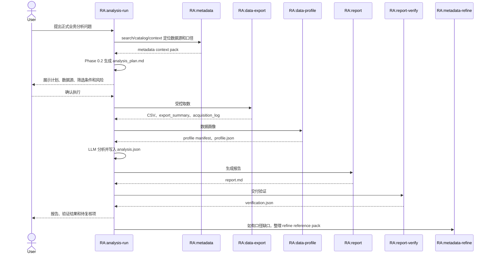
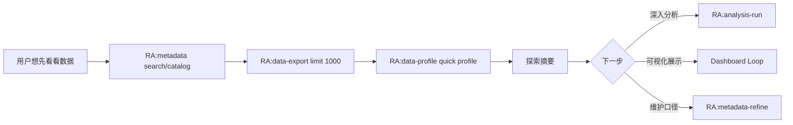
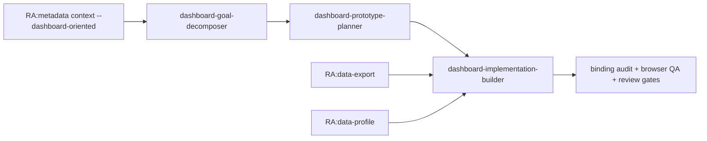

# RealAnalyst Skills 交互与产物详细设计

本文档描述 RealAnalyst 的当前目标交互模型：10 个 active skills 承担日常工作流，legacy compatibility skills 仅保留迁移和旧入口兼容。设计目标是减少用户需要记忆的入口，同时把 metadata、取数、画像、分析、报告和验证之间的数据契约讲清楚。

相关架构优化背景见 [skill-architecture-optimization-20260702.md](skill-architecture-optimization-20260702.md)。

---

## 设计原则

| 原则 | 说明 |
| --- | --- |
| 三核边界 | Metadata 管业务含义，Runtime Registry 管能不能取，Job 管本次实际用了什么。 |
| 主入口收敛 | 普通用户优先记住 `RA:getting-started`、`RA:metadata`、`RA:analysis-run`。 |
| Metadata-first | 选择数据集、字段、指标、筛选器、SQL 口径和报告结论前，先查 metadata，再查 live 数据。 |
| 共享能力复用 | `RA:data-export` 和 `RA:data-profile` 是项目共享能力，可被分析、dashboard、探索和 metadata refine 调用。 |
| 计划先于正式取数 | 正式分析必须先展示计划、数据源、筛选口径和风险，确认后再导出。 |
| 轻量探索不升级成正式 job | 只想看字段、样本和质量概况时走探索流程，不创建 `jobs/{SESSION_ID}/`。 |
| 产物 owner 清晰 | 每个 artifact 能回到唯一 owner skill 或明确的共享能力调用方。 |
| 兼容入口有迁移方向 | legacy skills 可以保留文件和提示，但新的编排默认不依赖它们。 |

---

## Skill 分类

### Active Skills

| 层级 | Skill | 定位 |
| --- | --- | --- |
| 入口层 | `RA:getting-started` | 初次使用、状态检查、下一步 skill routing。 |
| 共享层 | `RA:metadata` | 搜索、catalog、注册、维护、validate、index、context、registry sync 的统一入口。 |
| 共享层 | `RA:data-export` | 受控取数能力，服务正式分析、dashboard、探索和 metadata refine。 |
| 共享层 | `RA:data-profile` | 数据画像能力，服务正式分析、dashboard、探索和 metadata refine。 |
| 分析层 | `RA:analysis-run` | 正式分析入口，内置 planning、取数、画像、分析、报告和验证编排。 |
| 分析层 | `RA:report` | 基于 plan、profile、analysis 和证据生成 Markdown 报告。 |
| 分析层 | `RA:report-verify` | 检查报告证据链、推断口径、数据来源和交付 readiness。 |
| 分析层 | `RA:metadata-refine` | 把 job 反馈、profile 和真实数据探查整理成 metadata 修正参考材料。 |
| 仪表盘层 | `dashboard-goal-decomposer` | 把 dashboard 目标拆成问题树、指标、维度、筛选器和 chart intent。 |
| 仪表盘层 | `dashboard-prototype-planner` | 把 goal/chart/filter contract 转成 prototype、layout 和 Antigravity handoff。 |
| 仪表盘层 | `dashboard-implementation-builder` | 基于真实数据、view model、binding audit 和 browser QA 构建 dashboard。 |

> 仪表盘三段式是一个层级组合，因此 active skillset 的业务能力数按 10 个核心入口统计：共享层 3 个、分析层 4 个、仪表盘层 3 个。

### Legacy Compatibility Skills

| Legacy skill | 新路径 | 兼容策略 |
| --- | --- | --- |
| `RA:metadata-search` | `RA:metadata search/catalog/context` | 保留迁移提示；新流程直接调用 `RA:metadata`。 |
| `RA:analysis-plan` | `RA:analysis-run` Phase 0.2 | Planning 作为正式分析内置阶段。 |
| `RA:analysis-reference` | `skills/analysis-run/references/` | 不再作为独立 skill 调用，改为读取 references。 |
| `RA:reference-lookup` | `RA:metadata` 或 `RA:analysis-run` references | 仅保留旧脚本和旧 prompt 兼容。 |

---

## 主链路

### 正式分析

### 轻量数据探索

探索产物默认放在 `/tmp/exploration_*`，只输出字段列表、样本、分布概览、质量信号和候选问题。它不创建 job、不写正式报告、不沉淀长期 metadata。

### Dashboard Loop

Dashboard-oriented context 需要提供 `chart_intent`、`filter_role`、`aggregation_safety` 和 `view_model_readiness`，让 dashboard 设计从语义开始，而不是从页面组件开始。

---

## Skill 间数据契约

| 上游 | 下游 | 传递内容 | 契约重点 |
| --- | --- | --- | --- |
| `RA:metadata` | `RA:analysis-run` | context pack、dataset id、field/metric/term 语义、review 标记 | context pack 是最小上下文，不替代 YAML 真源。 |
| `RA:analysis-run` | `RA:data-export` | 已确认 plan、dataset id、字段白名单、筛选条件、输出目录 | 正式取数必须来自确认后的计划。 |
| `RA:data-export` | `RA:data-profile` | CSV 路径、export_summary、source lineage | 下游从 summary 或 artifact index 读实际路径。 |
| `RA:data-profile` | `RA:analysis-run` | profile manifest、profile.json、字段质量信号 | profile 是分析证据，不写回 dataset YAML。 |
| `RA:analysis-run` | `RA:report` | plan、profile、analysis.json、analysis_journal | 报告只使用已记录证据和明确假设。 |
| `RA:report` | `RA:report-verify` | report.md、artifact index、analysis evidence | 验证检查结论是否可追溯。 |
| `RA:analysis-run` | `RA:metadata-refine` | metadata feedback、profile、样本探查线索 | refine 只生成参考材料，不直接改 YAML。 |
| `dashboard-goal-decomposer` | `dashboard-prototype-planner` | goal/chart/filter contract、open questions | 先锁分析结构，再做布局。 |
| `dashboard-prototype-planner` | `dashboard-implementation-builder` | layout spec、view-model contract、Antigravity prompt contract | 允许 prototype 使用 mock，但实现必须替换为真实数据。 |
| `RA:data-export` / `RA:data-profile` | `dashboard-implementation-builder` | DWD/DWS/ADS 数据、profile、quality report | dashboard readiness 需要真实数据链路和 binding audit。 |

---

## 产物归属

| 产物 | Owner |
| --- | --- |
| dataset/dictionary/mapping YAML | `RA:metadata` |
| metadata index、catalog、context pack | `RA:metadata` |
| runtime registry sync | `RA:metadata` |
| CSV、export_summary、acquisition_log | `RA:data-export` |
| profile manifest、profile.json、quality summary | `RA:data-profile` |
| `normalized_request.json`、`analysis_plan.md`、`analysis.json`、`analysis_journal.md` | `RA:analysis-run` |
| Markdown report | `RA:report` |
| `verification.json`、delivery manifest | `RA:report-verify` |
| refine reference pack | `RA:metadata-refine` |
| dashboard goal/chart/filter contracts | `dashboard-goal-decomposer` |
| prototype/layout/view-model contracts | `dashboard-prototype-planner` |
| dashboard HTML/data assets/binding audit/browser QA evidence | `dashboard-implementation-builder` |

---

## 错误处理与回退

| 失败点 | 回退 owner | 处理方式 |
| --- | --- | --- |
| 找不到合适数据集或字段 | `RA:metadata` | search/catalog/context 后说明缺口；必要时做最小可分析注册。 |
| metadata 与 runtime registry 不一致 | `RA:metadata` | 运行 validate、index、sync-registry 或 reconcile。 |
| 取数失败 | `RA:data-export` | 检查 source id、字段白名单、filter/parameter、registry readiness。 |
| profile 暴露质量问题 | `RA:data-profile` + `RA:analysis-run` | 在分析计划或报告中标记质量限制，必要时补导出。 |
| 结论无法追溯 | `RA:report-verify` | 回到 analysis artifacts 补证据或降级结论强度。 |
| 字段或指标口径待修 | `RA:metadata-refine` | 生成 refine pack，再由 `RA:metadata` 正式维护 YAML。 |
| dashboard 模块只有视觉无绑定 | `dashboard-implementation-builder` | 回到 view model、data-slot、binding audit 和真实数据链路检查。 |

---

## 发布前检查

| 检查项 | 通过标准 |
| --- | --- |
| active skillset | 文档、README、skill frontmatter 对 active/legacy 的说法一致。 |
| legacy 迁移 | `metadata-search`、`analysis-plan`、`analysis-reference` 都有清楚迁移路径。 |
| 共享能力 | `data-export` 和 `data-profile` 不再只描述为 analysis-run 内部阶段。 |
| 探索边界 | 快速探索与正式分析的目录、产物、验证要求有明确区别。 |
| dashboard 链路 | dashboard 文档体现 metadata context、共享取数、画像、binding audit 和 browser QA。 |
| 验证证据 | 文档说明使用的验证点、通过结果和仍需源代码同步的边界。 |
