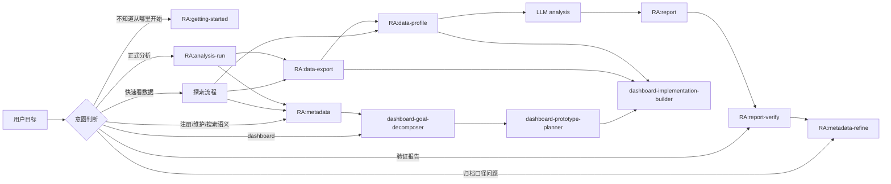

# RealAnalyst Skill 调用策略

本文档规定 RealAnalyst 在用户使用过程中的 skill 触发方式：什么时候自动进入 skill，什么时候先提示用户确认，什么时候只做聊天回答或文档解释。目标是减少手动点名 skill，同时避免把轻量咨询误升级为正式分析、取数或 metadata 写回。

相关架构优化背景见 [skill-architecture-optimization-20260702.md](skill-architecture-optimization-20260702.md)。

---

## 总原则

| 原则 | 说明 |
| --- | --- |
| 意图优先 | 先判断用户真实目标，再选择 skill；关键词只作为辅助信号。 |
| Source of truth 优先 | 业务口径先查 metadata，执行能力再查 registry，单次事实再查 job artifacts。 |
| 主入口少而稳 | 普通用户优先暴露 `RA:getting-started`、`RA:metadata`、`RA:analysis-run`。 |
| 共享能力可复用 | `RA:data-export` 和 `RA:data-profile` 可被多个流程调用，但调用方必须说明目标和输出路径。 |
| 正式动作有确认 | 正式取数、新 source、新口径写回、交付发布前保留确认点。 |
| 探索轻量化 | 用户只想预览数据时走探索流程，不创建正式 job。 |
| 展示问题留在展示层 | CSV 表头、报告展示名、导出列名不自动触发 metadata YAML 维护。 |
| Legacy 入口有迁移提示 | 旧入口可以响应，但应引导到新的 owner skill。 |

---

## 默认调用方式

| 层级 | Skill | 默认调用方式 |
| --- | --- | --- |
| 第一层入口 | `RA:getting-started` | 用户不知道从哪里开始、首次安装、环境状态不明时进入。 |
| 第一层入口 | `RA:metadata` | 注册、维护、搜索、catalog、context、registry readiness、dashboard-oriented context 时进入。 |
| 第一层入口 | `RA:analysis-run` | 用户要求正式分析且 metadata / registry 已能支撑时进入。 |
| 共享能力 | `RA:data-export` | 正式分析确认后、dashboard 构建、轻量探索、metadata refine 探查时调用。 |
| 共享能力 | `RA:data-profile` | 导出后画像、dashboard 数据审计、轻量探索、metadata refine 证据整理时调用。 |
| 分析内 | `RA:report` | 分析完成后由 `RA:analysis-run` 调用；也可用于已有分析 artifacts 的报告生成。 |
| 分析内 | `RA:report-verify` | 报告交付前、已有报告验收、PR 或发布前质量门禁时调用。 |
| 补充入口 | `RA:metadata-refine` | 分析反馈、真实数据探查和 profile 暴露口径问题时调用。 |
| 仪表盘 | dashboard 三段式 | 用户明确要求 dashboard、看板、可视化 cockpit、Antigravity HTML 或绑定审计时调用。 |
| Legacy | `RA:metadata-search` | 引导到 `RA:metadata search/catalog/context`。 |
| Legacy | `RA:analysis-plan` | 引导到 `RA:analysis-run` Phase 0.2。 |
| Legacy | `RA:analysis-reference` | 引导到 `analysis-run/references`。 |

---

## 自动进入 skill

| 用户意图 / 场景 | 自动进入 | 理由 |
| --- | --- | --- |
| “我想分析 X”，并且数据源已注册 | `RA:analysis-run` | 正式分析入口，能串联 plan、export、profile、report、verify。 |
| “帮我注册这个数据源 / 整理字段和指标口径” | `RA:metadata` | 目标是维护长期语义资产。 |
| “这个字段是什么意思 / 有没有这个指标 / 有哪些数据集” | `RA:metadata` | 统一入口承担 search、catalog 和 context。 |
| “先看看数据长什么样 / 有哪些字段 / 大概质量如何” | 数据探索流程，调用 `RA:metadata`、`RA:data-export`、`RA:data-profile` | 目标是预览，不是正式分析。 |
| “做一个 dashboard / 看板 / cockpit / 单 HTML 可视化” | dashboard 三段式 | 需要 goal、prototype、implementation 和 QA 分阶段推进。 |
| “报告写完了，帮我检查能不能交付” | `RA:report-verify` | 目标是门禁验证。 |
| “把分析中发现的口径问题整理给后续维护” | `RA:metadata-refine` | 生成修正参考材料，不直接改 YAML。 |
| “把 RealAnalyst metadata 交给 Data Analytics 使用” | `RA:data-analytics-semantic-export` | 这是跨系统语义投影。 |

---

## 先提示用户确认

| 场景 | 处理方式 |
| --- | --- |
| 用户只说“帮我看看能不能分析”，但缺少对象、时间或指标 | 先说明已知信息、候选方向和缺失项，不直接创建 job。 |
| 正式分析即将取数 | 展示计划、数据源、筛选条件、字段范围和风险，等确认后再调用 `RA:data-export`。 |
| 需要新增 source 或 source group 外的数据 | 说明为什么需要新增、会改变什么证据链，等确认后继续。 |
| metadata / registry 不足但用户急着分析 | 说明缺口，建议先做最小可分析注册；若用户坚持，只能输出假设边界。 |
| dashboard 仍停留在 mock 或原型阶段 | 标注 mock 证据类型，要求进入真实数据绑定和 QA 后才算 readiness。 |
| metadata YAML 正式写回 | 先生成 refine pack 或变更说明，再由用户确认写回。 |

---

## 不调用 skill

| 场景 | 不调用原因 |
| --- | --- |
| 用户只问概念、流程或文档解释 | 直接回答或指向 docs，不启动正式流程。 |
| 用户只要求 CSV 表头中文化、字段展示名调整 | 属于 export/report layer，不进入 metadata YAML 维护。 |
| 用户要求临时 SQL 试算且不需要可复核链路 | 使用普通 SQL 工具更合适；纳入 RealAnalyst 前需注册 source 和 metadata。 |
| 用户给出敏感样例值但未授权保存 | 不归档到 `metadata/sources/`，先提示脱敏或确认。 |
| 已有 job 数据足够回答追问 | 复用当前 job artifacts，不重复导出。 |

---

## 面向用户的解释方式

Agent 不需要频繁暴露内部 skill 名称。只有在进入工作流、等待确认、迁移路径、失败回退时，需要明确告诉用户当前使用哪个入口。

推荐表达：

```text
我会先走轻量 metadata 检索，不直接取数。先找候选数据集和字段口径，再生成本轮 context；等你确认分析计划后，再进入正式取数、画像、分析和报告。
```

```text
这次只是数据探索，我会限制样本量并把产物放在临时目录。它不会创建正式 job；如果你确认要深入分析，再升级到 RA:analysis-run。
```

```text
这个问题属于字段展示层，不需要改 metadata YAML。我会在导出或报告阶段处理展示名，避免破坏字段 identity。
```

```text
这个 dashboard 目前只能算原型通过。最终 readiness 还需要真实数据链路、view model 绑定审计、控件覆盖和浏览器 QA 证据。
```

---

## 主工作流调用图



---

## 发布前检查清单

| 检查项 | 通过标准 |
| --- | --- |
| Frontmatter description | 能清楚触发该 skill，并说明误触发边界。 |
| 用户入口 | 普通用户不用记住所有流程内 skill。 |
| 自动调用 | 流程内 skill 有明确上游、下游和产物契约。 |
| 共享能力 | data-export/data-profile 的调用方、输出路径和证据类型清楚。 |
| 频率控制 | search/context/profile 可以轻量调用；export/report/verify 只在合适节点调用。 |
| 用户解释 | 关键节点能解释为什么进入该 skill。 |
| 产物 owner | 每个文件能追溯到唯一 owner skill 或共享能力调用方。 |
| 失败回退 | 失败项能回到具体 owner 修复。 |
