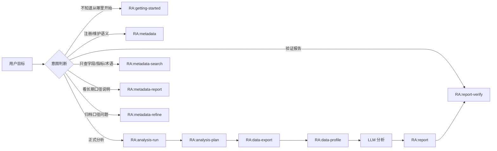

# RealAnalyst Skill 调用策略

本文档规定 RealAnalyst 在用户使用过程中的 skill 触发方式：什么时候由 Agent 自动进入对应 skill，什么时候只提示用户下一步，什么时候明确不调用。目标是避免用户每次都必须手动说 `/skill ...`，同时避免过度调用、重复取数或把轻量咨询误升级成完整分析流程。

---

## 1. 总原则

| 原则 | 说明 |
| --- | --- |
| 意图优先 | 先判断用户真实目标，再选择 skill；不要只靠关键词硬匹配。 |
| 三核边界 | Metadata 管业务含义，Runtime Registry 管能不能取，Job 管本次实际用了什么。 |
| 主入口少而稳 | 普通用户第一层只暴露 `RA:getting-started`、`RA:metadata`、`RA:analysis-run`。 |
| 流程内自动 | `analysis-plan`、`data-export`、`data-profile`、`report`、`report-verify` 通常由 `RA:analysis-run` 自动编排，不要求用户逐个点名。 |
| 关键动作停顿 | 正式取数、引入新 source、交付前动作必须保留确认点。 |
| 低成本先行 | 需求理解先走 search/catalog/context，避免直接读取完整 YAML、全库扫描或直接导出。 |
| 不把展示问题升级为治理问题 | CSV 表头、报告展示名、导出列名属于 export/report layer，不自动触发 metadata YAML 维护。 |

---

## 2. Skill 分层与默认调用方式

| 层级 | Skill | 默认调用方式 |
| --- | --- | --- |
| 第一层入口 | `RA:getting-started` | 用户不知道从哪里开始、首次安装、状态不明时自动建议或进入。 |
| 第一层入口 | `RA:metadata` | 用户要注册/维护数据源、字段、指标、术语、口径、context 或 registry readiness 时进入。 |
| 第一层入口 | `RA:analysis-run` | 用户要做正式分析，且 metadata / registry 已可支撑时进入。 |
| 常见补充入口 | `RA:metadata-report` | 用户要看长期口径说明、注册说明或 review gap 报告时进入。 |
| 常见补充入口 | `RA:metadata-refine` | 分析反馈、profile 或真实数据探查需要整理成 metadata 修正材料时进入。 |
| 常见补充入口 | `RA:report-verify` | 用户已有报告或报告写完后，需要交付前门禁时进入。 |
| 流程内 | `RA:analysis-plan` | 由 `RA:analysis-run` 在规划阶段调用；高级手工编排才直接调用。 |
| 流程内 | `RA:data-export` | 由 `RA:analysis-run` 在已确认 plan 后调用；普通用户不从这里开始。 |
| 流程内 | `RA:data-profile` | 导出后自动进入；用户手工要求“只做画像”时可直接进入。 |
| 流程内 | `RA:report` | 分析阶段完成后由 `RA:analysis-run` 调用；用户只写既有分析报告时可直接进入。 |
| 辅助 | `RA:metadata-search` | 低 token 检索字段/指标/术语/dataset/catalog；其它 skill 可频繁但轻量地调用。 |
| 辅助 | `RA:analysis-reference` | 查框架和模板；仅在 planning/report 需要时调用。 |
| 高级 | `RA:artifact-fusion` | source group 已确认且多个导出产物需要 union/join/passthrough 时调用。 |
| 交接 | `RA:data-analytics-semantic-export` | 用户明确要把 RealAnalyst metadata 导出给 Data Analytics 复用时调用。 |
| 兼容 | `RA:reference-lookup` | legacy compatibility only；新流程默认不用。 |

---

## 3. 自动调用、提示调用、不调用

### 3.1 应自动进入 skill

| 用户意图 / 场景 | 自动进入 | 理由 |
| --- | --- | --- |
| “我想分析 X，已有 metadata / 数据源注册好了” | `RA:analysis-run` | 这是正式分析入口。 |
| “帮我注册这个数据源 / 整理字段和指标口径” | `RA:metadata` | 目标是维护长期语义资产。 |
| “这个字段是什么意思 / 有没有维护过这个指标” | `RA:metadata-search` | 只查 index，不需要进入完整 metadata 维护。 |
| “给我看这个数据集的元数据说明” | `RA:metadata-report` | 目标是长期口径说明，不是业务分析。 |
| “报告写完了，帮我检查能不能交付” | `RA:report-verify` | 目标是门禁验证。 |
| “把这次分析中发现的口径问题整理给后续维护” | `RA:metadata-refine` | 只生成修正参考材料，不直接改 YAML。 |
| “把 RealAnalyst metadata 交给 Data Analytics 使用” | `RA:data-analytics-semantic-export` | 这是跨系统语义投影。 |

### 3.2 应先提示用户，而不是直接执行

| 场景 | 处理 |
| --- | --- |
| 用户说“帮我看看能不能分析”但缺少对象、时间或指标 | 给出已知信息、建议方向和缺失项；不要直接创建 job。 |
| 需要正式导出数据 | 展示计划、数据源、筛选条件和风险；等用户确认后再调用 `RA:data-export`。 |
| 需要引入新的 source 或 source group 外的数据 | 说明为什么需要新增、会带来什么变化；等用户确认。 |
| metadata / registry 不足但用户急着分析 | 说明缺口，建议先进入 `RA:metadata` 做最小可分析注册。 |
| 用户只是在学习 RealAnalyst | 用 `RA:getting-started` 解释入口和准备材料，不执行取数或治理动作。 |

### 3.3 明确不调用 skill

| 场景 | 不调用原因 |
| --- | --- |
| 用户只问概念、流程或文档解释 | 直接回答或指向文档；不启动正式流程。 |
| 用户只要求 CSV 表头中文化、字段展示名调整 | 属于 export/report layer，不进入 metadata YAML 维护。 |
| 用户要求任意 SQL 临时查询 | RealAnalyst 不替代临时 SQL 工具；若要纳入可复核流程，先注册 source 和 metadata。 |
| 用户给出敏感样例值但未授权保存 | 不归档到 `metadata/sources/`；先提示脱敏或确认。 |
| 已有 job 数据足够回答追问 | 不重复取数；复用当前 job 的数据和 profile。 |

---

## 4. 面向用户的提示方式

Agent 不应频繁向用户解释内部 skill 名称。只有在以下时机需要让用户知道：

1. **首次进入某条工作流时**：说明“我会先用 `RA:metadata-search` 找可用数据集，再用 `RA:analysis-run` 生成计划”。
2. **需要用户确认时**：说明“确认后我会进入 `RA:data-export` 取数，再画像、分析和写报告”。
3. **用户需要迁移工作流时**：例如从分析转到口径修正，说明“这不是继续分析，而是进入 `RA:metadata-refine` 生成修正材料”。
4. **失败或缺口出现时**：说明应该回到哪个 owner skill 修复，而不是让用户猜。

推荐话术：

```text
我会先走轻量检索，不直接取数：先用 metadata search 找候选数据集，再生成本轮 context。等你确认分析计划后，才进入正式取数、画像、分析和报告。
```

```text
这个问题属于字段展示层，不需要改 metadata YAML。我会在导出/报告阶段处理展示名，避免破坏字段 identity。
```

---

## 5. 主工作流调用图



---

## 6. 扩展到非元数据 / 非数据分析流程

RealAnalyst 当前最成熟的是 metadata-first 数据分析链路，但 skill 调用策略不应被写死成“只有元数据和分析”。新增工作流时按同一方法扩展：

| 新工作流类型 | 设计方式 |
| --- | --- |
| 文档审查 | 建立“第一层入口 + 流程内 parser/verify/export”分层，避免用户点名每个子步骤。 |
| 项目管理 | 将“需求 intake / 任务拆解 / 状态同步 / 复盘报告”拆成 owner skill 与流程内 skill。 |
| 研究工作流 | 先设计 search/read/evidence pack，再设计 synthesis/report/verify。 |
| 数据产品运营 | 把指标治理、用户反馈、实验分析、版本说明分层，不让单一 skill 承担全部职责。 |

每个新工作流都必须回答四个问题：

1. 普通用户第一层入口是什么？
2. 哪些能力只能由流程内自动调用？
3. 哪些节点必须等待用户确认？
4. 产物 owner 是谁，失败时回到哪个 skill 修复？

---

## 7. 发布前检查清单

| 检查项 | 通过标准 |
| --- | --- |
| Frontmatter description | 能清楚触发该 skill，且包含不要误触发的边界。 |
| 用户入口 | 普通用户不用记住所有流程内 skill。 |
| 自动调用 | 流程内 skill 有明确上游、下游和产物契约。 |
| 频率控制 | search/reference 可以轻量调用；export/profile/report/verify 只在流程节点调用。 |
| 用户解释 | 关键节点能解释为什么使用某个 skill。 |
| 产物 owner | 每个文件能追溯到唯一 owner skill。 |
| 失败回退 | 失败项能回到具体 skill 修复，而不是让用户重来。 |
