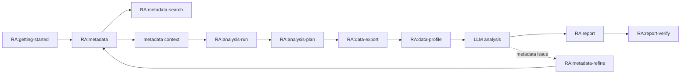

# RealAnalyst Skillset 审查报告

本报告记录对 RealAnalyst 项目内 skillset、脚本、模板、交付物链路和调用策略的审查结论。审查目标不是重写所有 skill，而是确认当前 skillset 是否能够稳定支撑 metadata-first 的数据分析流程，并补齐会影响 Agent 高效调用的规则。

> 维护说明：本文件保留为历史审查记录。2026-07-02 后的 active skillset、legacy 迁移和共享能力口径，以 [skill-architecture-optimization-20260702.md](skill-architecture-optimization-20260702.md)、[skill-interaction-design.md](skill-interaction-design.md) 和 [skill-invocation-policy.md](skill-invocation-policy.md) 为准。

---

## 1. 总体结论

RealAnalyst 当前 skillset 的主体设计是成立的：

- 已形成清晰的三核边界：Metadata Core 管业务含义，Runtime Registry Core 管运行可取性，Job Core 管单次分析证据链。
- 普通用户第一层入口基本收敛为 `RA:getting-started`、`RA:metadata`、`RA:analysis-run`，流程内 skill 由 `RA:analysis-run` 编排。
- metadata 管理、取数、画像、分析、报告、验证、反馈归档已经形成闭环。
- 报告模板、元数据报告模板、分析框架配置、输出契约等核心模板文件存在，没有发现阻断性的模板缺失。
- 本轮发现并修复了一个脚本 stdout 契约问题：`skills/data-profile/scripts/profiling_with_meta.py` 原来在成功时输出两个 JSON 对象，可能导致自动化调用方解析失败；现已调整为成功时只输出 wrapper 的单个 JSON 对象。

仍需后续继续整理的非阻断问题：

- `docs/skill-interaction-design.md` 仍写“14 个 skill”，而当前 skill 清单已是 15 个；文档需要跟随 `RA:data-analytics-semantic-export` 补齐。
- `docs/skill-interaction-design.md` 对 `RA:artifact-fusion` 的 join 描述仍偏旧，实际 skill 已支持 `--join-key` 键 join。
- 部分 wrapper 的 docstring 仍只写 `artifact_index`，但实际 `scripts/update_artifact_index.py` 已会同步 `job_manifest.json`；建议后续统一文案，避免维护者误判。

---

## 2. Skill 清单与职责审查

| Skill | 定位 | 主要产物 / 输出 | 审查结论 |
| --- | --- | --- | --- |
| `RA:getting-started` | 第一层入口；轻量向导、状态检查、skill router | doctor JSON、下一步 skill 建议 | 职责清晰；不取数、不建正式 job、不自动写 metadata，边界合理。 |
| `RA:metadata` | 第一层入口；注册、维护、校验、索引、context、registry sync | metadata YAML、audit、index、context、registry readiness | 是 Metadata Core 主入口，层次完整；适合承接最小可分析注册。 |
| `RA:analysis-run` | 第一层入口；正式分析总控 | job 目录、analysis.json、报告、verification | 编排边界清晰；要求确认停顿、单 session 单 job、append-only。 |
| `RA:analysis-plan` | 流程内规划 | `.meta/analysis_plan.md` | 明确使用 normalized request + metadata context；避免直接扫完整 YAML。 |
| `RA:data-export` | 流程内受控取数 | CSV、export summary、acquisition log、job manifest | 后端合并合理；Tableau / DuckDB / MySQL / ClickHouse 边界清晰。 |
| `RA:data-profile` | 流程内画像 | `profile/manifest.json`、`profile/profile.json` | 来源绑定要求正确；本轮修复 wrapper stdout 契约。 |
| `RA:report` | 流程内报告写作 | 业务报告 Markdown、输出文件清单 | 模板锁定、append-only、证据链规则完整。 |
| `RA:report-verify` | 交付门禁 | `verification.json`、`delivery_manifest.json` | 能覆盖证据链、数字追溯、用户态泄漏和交付清单。 |
| `RA:metadata-search` | 辅助检索 | search/catalog JSON | 低 token 入口合理；适合在需求理解阶段频繁调用。 |
| `RA:metadata-report` | 常见补充入口；元数据说明 | metadata Markdown report | dataset-first 模板存在；不混入业务分析结论。 |
| `RA:metadata-refine` | 常见补充入口；口径修正材料 | refine reference pack | 能把 job/profile/CSV 反馈转成正式 metadata 维护输入。 |
| `RA:artifact-fusion` | 高级多源融合 | merged CSV、lineage manifest | 策略完整；文档层需同步实际 key join 能力。 |
| `RA:analysis-reference` | 辅助查询框架/模板 | template/framework JSON | 与 `metadata-search` 边界清楚，避免 lookup 混杂。 |
| `RA:data-analytics-semantic-export` | 跨系统语义导出 | semantic-layer skill package | 交接定位清晰；但交互设计文档需要补入。 |
| `RA:reference-lookup` | legacy compatibility | lookup JSON | 保留兼容合理；新流程应默认不用。 |

---

## 3. 脚本与模板审查

### 3.1 关键脚本

| 区域 | 代表脚本 | 结论 |
| --- | --- | --- |
| 环境固定 | `skills/getting-started/scripts/doctor.py` | 能输出固定环境摘要，避免 Agent 自由探测 Python / registry。 |
| metadata core | `skills/metadata/scripts/metadata.py` | 命令集合覆盖 init、validate、index、context、sync-registry、status、reconcile、profile-review、audit。 |
| metadata lookup | `skills/metadata-search/scripts/search.py`、`catalog.py` | 低 token 检索与 catalog 分离清楚。 |
| data export | `skills/data-export/scripts/*/*_export_with_meta.py` | wrapper 负责导出、采集日志和产物索引；后端模型一致。 |
| artifact index | `scripts/update_artifact_index.py` | 同步 `.meta/artifact_index.json` 与 `job_manifest.json`，是 Job Core 的关键粘合点。 |
| data profile | `skills/data-profile/scripts/profiling_with_meta.py` | 已修复 stdout 双 JSON 问题，成功时保持单 JSON 输出契约。 |
| report verify | `skills/report-verify/scripts/verify.py`、`build_delivery_manifest.py` | 支撑门禁检查与交付清单。 |

### 3.2 模板 / reference 文件

| 模板 / Reference | 作用 | 结论 |
| --- | --- | --- |
| `skills/report/references/template-system-v2.md` | 6 个核心报告模板体系 | 存在，能支撑模板锁定。 |
| `skills/report/references/template-matrix.md` | 分析模式到模板映射 | 存在，适合 planning/report 对齐。 |
| `skills/report/references/output-contract.md` | 报告输出、附件和用户态清单 | 存在，能支撑交付规范。 |
| `skills/report/references/appendix-template.md` | 临时/新增口径附录 | 存在，能支撑 report verify。 |
| `skills/metadata-report/references/report-template.md` | dataset-first 元数据报告模板 | 存在，能支撑元数据说明。 |
| `skills/analysis-reference/references/analysis-frameworks.json` | 分析框架 registry | 存在，能支撑 analysis-plan 选框架。 |
| `skills/data-profile/references/output-schema.md`、`large-file-rules.md` | 画像输出和大文件规则 | SKILL.md 已引用，作为画像阶段扩展契约。 |

未发现阻断性的模板文件缺失。建议后续补一条 CI smoke test：扫描所有 `SKILL.md` 中的 `references/` 与 `scripts/` 路径，检查引用文件是否存在，并对主要 CLI 执行 `--help`。

---

## 4. Skill 之间的关联性与交付物完整性

当前链路基本完整：

交付物 owner 边界合理：

| 产物 | Owner |
| --- | --- |
| metadata YAML / index / context / registry sync | `RA:metadata` |
| metadata Markdown report | `RA:metadata-report` |
| CSV / export summary / acquisition log | `RA:data-export` |
| profile manifest / profile details | `RA:data-profile` |
| analysis.json / analysis journal | `RA:analysis-run` |
| 业务报告 Markdown | `RA:report` |
| verification / delivery manifest | `RA:report-verify` |
| refine reference pack | `RA:metadata-refine` |
| semantic-layer package | `RA:data-analytics-semantic-export` |

核心判断：这套 owner 分配能避免“一个 skill 同时治理 metadata、取数、写报告、交付”的过载问题，也能让失败项回到明确 owner 修复。

---

## 5. 生成与数据分析流程有效性

有效点：

1. 需求理解阶段先 search/catalog/context，避免直接读取完整 YAML 或直接扫运行库。
2. 正式分析必须先生成计划并等待用户确认，能控制误取数和误分析。
3. 取数只走 runtime registry 中已注册 source，不鼓励自由 SQL 或任意连接信息。
4. profile 与 CSV 绑定，能支撑报告格式化和 verify。
5. 报告阶段锁定模板，防止 report 阶段重新选模板导致前后不一致。
6. verify 阶段检查数字、趋势、排名、证据链和用户态泄漏，能支撑可交付性。
7. metadata 问题只记录为 feedback/refine，不在分析流程中偷偷改 YAML，符合长期资产治理边界。

效率风险与处理：

| 风险 | 当前处理 | 本轮补强 |
| --- | --- | --- |
| 用户每一步都要手动 `/skill` | `analysis-run` 已编排流程内 skill | 新增 `docs/skill-invocation-policy.md`，明确自动调用/提示/不调用策略。 |
| skill 过度调用 | search/reference 轻量，export/report/verify 有流程节点 | 调用策略要求低成本先行、关键动作确认。 |
| 多轮分析重复取数 | analysis-run 要求复用当前 job 数据 | 调用策略中明确“已有数据足够时不重复取数”。 |
| 展示名问题误触发 metadata 治理 | 多个 SKILL.md 已强调 display layer | 调用策略再次固化“不把展示问题升级为治理问题”。 |
| wrapper stdout 不稳定 | 原 data-profile wrapper 输出两个 JSON | 已修复为单 JSON。 |

---

## 6. 对 metadata 管理和数据分析的支撑度

支撑度较强，原因是：

- `RA:metadata` 承担 metadata YAML、index、context、sync-registry 的统一入口。
- `RA:metadata-search` 把需求理解的检索成本降到最低。
- `RA:metadata-report` 把长期口径说明从业务报告中拆出，避免分析报告混入治理材料。
- `RA:metadata-refine` 把分析中发现的问题沉淀为 reference pack，再由 `RA:metadata` 正式治理。
- `RA:analysis-run` 使用 metadata context 和 runtime registry 组织正式 job，确保语义、可取性和本次证据链分离。

这套链路不仅能支撑 metadata 和数据分析，也给其它工作流提供了可复用模式：第一层入口、低成本检索、流程内自动编排、关键动作确认、owner skill 修复、最终门禁。

---

## 7. 本轮 PR 改动

| 文件 | 改动 |
| --- | --- |
| `skills/data-profile/scripts/profiling_with_meta.py` | 修复成功 stdout 双 JSON；现在成功时只输出 wrapper summary JSON，失败诊断进入 stderr。 |
| `docs/skill-invocation-policy.md` | 新增 skill 调用策略，覆盖自动调用、提示调用、不调用、用户解释和扩展到其它工作流。 |
| `docs/skillset-audit-report.md` | 新增本审查报告。 |
| `docs/README.md` | 将调用策略与审查报告加入文档索引，并避免继续传播旧的 skill 数量表述。 |

---

## 8. 后续建议

1. 更新 `docs/skill-interaction-design.md`：把 14 改为 15，补入 `RA:data-analytics-semantic-export`，同步 `artifact-fusion` key join 能力。
2. 增加 skill 引用检查脚本：扫描所有 `SKILL.md` 里出现的 `scripts/`、`references/`、`assets/` 路径是否存在。
3. 增加 CLI smoke test：对核心脚本跑 `--help`，对 demo metadata 跑 validate/index/search/context。
4. 对每个 wrapper 的 stdout 建立统一约定：成功只输出一个 JSON，日志和诊断走 stderr。
5. 在新增非数据分析工作流时复用 `docs/skill-invocation-policy.md` 的分层方法，不把所有能力塞进单一大 skill。
