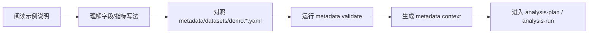

# Examples

这里保存公开、脱敏的示例。
示例的目标不是提供真实行业默认配置，而是帮助你理解 RealAnalyst 的 metadata 写法、字段解释方式和报告口径表达方式。

---

## 当前示例

| 文件 | 说明 |
| --- | --- |
| `airline-metadata-example.md` | 用航空场景解释 metadata 字段、指标、术语和 review 方式 |

---

## 示例应该怎么读？

---

## 示例能做什么？

- 帮你理解字段描述应该写到什么粒度
- 帮你理解指标定义、单位、粒度、证据和 review 状态怎么写
- 帮你判断哪些内容可以放公开仓库，哪些内容应该留在本地或私有仓库
- 帮你训练团队用同一种方式描述业务口径

---

## 示例不能做什么？

| 误区 | 正确理解 |
| --- | --- |
| 把示例当默认行业模板 | 示例只是解释写法，不代表默认行业 |
| 复制示例 source id 到真实项目 | 真实项目应使用自己的 source id |
| 把真实公司名放进示例 | 公开示例必须脱敏 |
| 用示例字段直接做业务判断 | 示例不具备真实业务含义 |

---

## 可扩展示例

| 示例 | 价值 |
| --- | --- |
| `retail-quickstart.md` | 用 demo retail 数据跑通 validate → index → search → context |
| `tableau-source-onboarding.md` | 演示 Tableau sync 快照如何整理成 metadata YAML |
| `duckdb-source-onboarding.md` | 演示 DuckDB catalog 如何进入 registry 和 metadata |
| `report-before-after.md` | 展示普通结论如何升级成“结论 + 证据 + 推导” |
