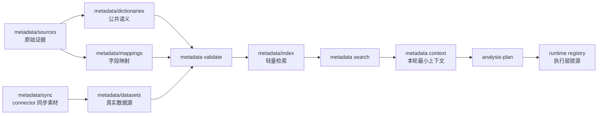

# Metadata

`metadata/` 是 RealAnalyst 的业务语义资产区。
它不负责取数，也不保存连接密钥；它负责让 Agent 在分析前知道 **数据代表什么、指标怎么算、哪些口径还不确定**。

---

## 你什么时候会打开这个目录？

| 场景 | 你要看哪里 |
| --- | --- |
| 保存用户提供的原始材料或迁移输入 | `sources/` |
| 维护公共指标、维度、术语 | `dictionaries/` |
| 维护 source 字段到标准语义的映射 | `mappings/` |
| 注册或维护数据集 | `datasets/` |
| 查看 metadata 维护日志和变更报告 | `audit/` |
| 组织多个数据集到一个业务域 | `models/` |
| 查看 Tableau / DuckDB 同步快照示例 | `sync/` |
| 理解 metadata 如何变成 index / context / OSI | `conversion/` |
| 运行后查找生成的检索索引 | `index/`，本地生成，不上传 |
| 对外交换语义模型 | `osi/`，本地生成，不上传 |

---

## Metadata 在整体流程中的位置



---

## 子目录说明

| 目录 | 作用 | 是否建议提交到公开仓库 |
| --- | --- | --- |
| `sources/` | 原始证据、用户材料、迁移输入，不直接作为分析上下文 | 只提交脱敏 example |
| `dictionaries/` | 公共 metrics / dimensions / glossary | 只提交脱敏 example |
| `mappings/` | source 字段到标准语义的映射和口径覆盖 | 只提交脱敏 example |
| `datasets/` | 真实可分析数据源，一个 source 一个 YAML | 只提交 demo/example |
| `audit/` | metadata 维护日志和变更报告，记录谁改了什么、为什么改、依据是什么 | 默认不提交生成日志，只提交 README |
| `models/` | 语义模型，把多个数据集组织成业务域 | 只提交 demo/example |
| `sync/` | Tableau / DuckDB connector 同步快照，给 LLM 整理 metadata 用 | 只提交 `.example.*` |
| `index/` | 从 YAML 编译出的轻量检索索引（JSONL + search.db FTS5） | 不提交 |
| `osi/` | 从 metadata 导出的标准交换文件 | 不提交，除非是脱敏示例 |
| `conversion/` | 描述 metadata 转换关系和契约 | 可以提交 |

---

## Metadata 状态规则

| 状态 | 含义 | 分析时怎么用 |
| --- | --- | --- |
| `verified` | 已确认业务定义 | 可以作为确定口径使用 |
| `draft` | 可用于探索，但证据或定义仍不完整 | 报告中必须暴露风险 |
| `deprecated` | 已废弃，保留血缘 | 不用于新分析 |

如果字段或指标出现 `needs_review: true`，分析计划和报告必须把它当作待确认口径，不能写成确定事实。

---

## 最小维护流程

```bash
python3 skills/metadata/scripts/metadata.py validate
python3 skills/metadata/scripts/metadata.py index
python3 skills/metadata/scripts/metadata.py record-change --summary "补充字段定义和证据" --path metadata/datasets/demo.retail.orders.yaml --dataset-id demo.retail.orders
python3 skills/metadata/scripts/metadata.py change-report
python3 skills/metadata/scripts/metadata.py catalog
python3 skills/metadata/scripts/metadata.py search --type all --query revenue
python3 skills/metadata/scripts/metadata.py context --dataset-id demo.retail.orders --metric total_revenue
python3 skills/metadata/scripts/metadata.py context --dataset-id id_1 --dataset-id id_2
python3 skills/metadata/scripts/metadata.py reconcile
```

如果是基于 `metadata/sources/refine/` 修改 YAML，修改前先保存旧 YAML 副本，并用 `--before` 生成对比报告。

---

## 结构契约

完整 YAML 结构见 `skills/metadata/references/yaml-structure-contract.md`。

一份高质量 dataset YAML 应该包含：

| 模块 | 必填信息 |
| --- | --- |
| Dataset identity | `id`、展示名、来源系统、对象名 |
| Business context | 适用场景、不适用场景、粒度、时间字段 |
| Fields | 字段名、角色、类型、业务定义、证据、置信度、review 状态 |
| Metrics | 指标公式、单位、粒度、业务含义、证据、置信度、review 状态 |
| Glossary | 术语、同义词、定义、证据 |
| Open questions | 待确认口径、owner、后续动作 |

---

## 常见卡点

| 卡点 | 现象 | 解决办法 |
| --- | --- | --- |
| `validate` 失败 | 不能进入 index/context | 按报错补齐字段、指标、证据或 review 标记 |
| `search` 没结果 | 指标未进入索引 | 先运行 `metadata.py index`，再确认 YAML 中是否存在关键词；FTS5 检索需要 search.db 存在 |
| context 太大 | Agent 读到过多无关字段 | search 后只传本轮需要的 `dataset-id`、metric、field |
| connector 快照很完整，但业务定义仍不清楚 | 字段名有了，口径没写 | 将快照整理回 `datasets/*.yaml`，补业务定义和证据 |
