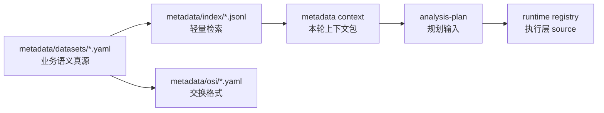

# Metadata Conversion

这里说明 metadata 在 RealAnalyst 中如何从“人能维护的 YAML”变成“Agent 能高效使用的上下文”。

---

## 转换链路



---

## 每层负责什么？

| 层级 | 作用 | 谁维护 |
| --- | --- | --- |
| YAML 真源 | 保存完整字段、指标、业务定义、证据、review 状态 | LLM + reviewer |
| Index | 把 YAML 编译成低 token 检索记录 | 脚本生成 |
| Context pack | 抽取本轮分析需要的最小语义上下文 | `metadata context` 生成 |
| Runtime registry | 让程序知道如何稳定取数 | connector / runtime 维护 |
| OSI | 对外交换语义模型 | 按需导出 |

---

## 关键边界

- 不从 YAML 反写覆盖 `registry.db`
- Tableau / DuckDB adapter 只提供初始化素材，不替代业务口径
- OSI 是交换层，不是本地分析主路径
- context pack 是 `analysis-plan` 的正式语义输入
- `needs_review=true` 必须传递到计划、报告和验证阶段

---

## 推荐操作顺序

```bash
python3 skills/metadata/scripts/metadata.py validate
python3 skills/metadata/scripts/metadata.py index
python3 skills/metadata/scripts/metadata.py search --type all --query <关键词>
python3 skills/metadata/scripts/metadata.py context --source-id <source_id> --metric <metric_id>
```

---

## 常见误区

| 误区 | 正确做法 |
| --- | --- |
| 直接让 Agent 读取完整 YAML | 先 search，再 context |
| 把 connector 字段名当业务定义 | 字段名只是素材，业务定义要写回 YAML |
| 让 runtime registry 成为口径真源 | registry 是执行层，不解释业务 |
| 把 OSI 当分析入口 | OSI 只用于交换，不替代本地 context |
