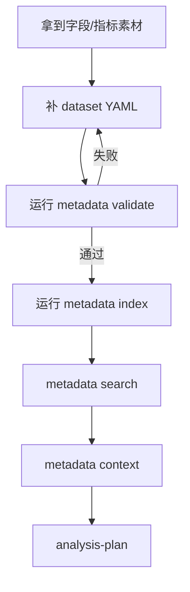

# Metadata Datasets

这里保存 RealAnalyst 的数据集语义真源。
每个 YAML 文件描述一个数据集：它从哪里来、包含哪些字段、有哪些指标、业务口径是否已确认。

`datasets/` 只放真实可分析数据源。公共指标、维度、术语放到 `metadata/dictionaries/`；字段映射和口径覆盖放到 `metadata/mappings/`；原始材料放到 `metadata/sources/`。

---

## 一个 dataset YAML 应该回答的问题

| 问题 | YAML 中应体现 |
| --- | --- |
| 这个数据集是什么？ | `id`、`display_name`、描述 |
| 从哪里来？ | connector、source、object、dashboard 或 table |
| 粒度是什么？ | 一行代表订单、用户、日期、航班还是其他对象 |
| 有哪些时间字段？ | 可用于筛选、趋势、同比/环比的字段 |
| 有哪些字段？ | 字段类型、角色、业务定义、证据 |
| 有哪些指标？ | 公式、单位、粒度、适用范围 |
| 哪些定义没确认？ | `needs_review`、open questions、owner |

---

## 维护流程

---

## 公开仓库规则

| 内容 | 是否提交 |
| --- | --- |
| `demo.*.yaml` | 可以提交 |
| 脱敏 example | 可以提交 |
| 真实公司数据集 | 不建议提交 |
| 真实 source id / dashboard id | 不提交 |
| 敏感字段备注 / owner 信息 | 视敏感程度决定，公开仓库默认不提交 |

---

## 写法建议

- 字段名可以保留系统字段名，但描述要写给业务用户看
- 指标必须写清公式、单位、粒度、适用范围
- 不确定的口径不要硬写成确定事实，使用 `needs_review: true`
- 证据可以来自 dashboard 说明、SQL、owner 确认或数据字典
- 低置信度定义要写原因，不要只写“待确认”

---

## 卡点检查

| 检查项 | 不满足时的风险 |
| --- | --- |
| 是否有唯一 `id` | search/context 无法稳定定位 |
| 字段是否有业务定义 | 报告会变成字段名复述 |
| 指标是否有公式 | Agent 容易误算 |
| 是否标记 `needs_review` | 不确定口径会被当成确定事实 |
| 是否有证据 | report-verify 难以通过 |
