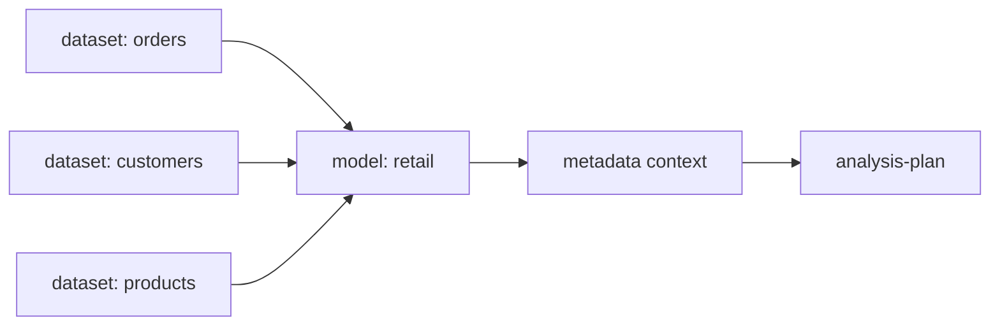

# Metadata Models

这里保存语义模型。
语义模型用于把多个 dataset 组织成一个业务域，让 Agent 知道哪些数据集可以一起理解、哪些指标属于同一个分析主题。

---

## 什么时候需要 model？

| 场景 | 是否需要 |
| --- | --- |
| 只有一个独立数据集 | 不一定需要 |
| 多个数据集共同描述一个业务域 | 建议需要 |
| 一个报告要跨订单、客户、产品、渠道 | 建议需要 |
| 需要告诉 Agent 哪些数据集可以一起使用 | 需要 |
| 只是临时导出一张表 | 不需要 |

---

## 语义模型的位置

---

## 一个 model 应说明什么？

| 内容 | 说明 |
| --- | --- |
| 业务域 | 例如 retail、sales、support |
| 包含的数据集 | 哪些 dataset 属于这个模型 |
| 关系说明 | 数据集之间是否可 join、按什么字段关联 |
| 推荐分析场景 | 适合做什么问题 |
| 不适用场景 | 哪些问题不能用这个模型回答 |
| 口径边界 | 哪些指标是模型级定义，哪些是数据集级定义 |

---

## 公开仓库规则

公开仓库只保留 demo/example。真实业务模型建议放在本地或私有仓库，尤其当模型中包含真实系统名、业务线名、真实 source id 或敏感字段关系时。

---

## 常见卡点

| 卡点 | 解决办法 |
| --- | --- |
| model 里列了多个 dataset，但没写关系 | 补充关联字段和适用场景 |
| dataset 可以一起看，但不能 join | 明确写成“同域参考”，不要误导为可融合 |
| model 与 dataset 中指标定义冲突 | 回到 metadata review，确认唯一口径 |
