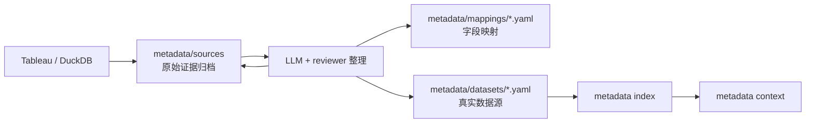

# Metadata Sync

这里保存 connector 同步快照。
同步快照来自 Tableau、DuckDB 等外部系统，包含 workbook、字段、筛选器、table catalog 等结构信息。

> 它们是整理 metadata 的素材，不是最终业务定义。

---

## Sync 与 Dataset 的关系

---

## 子目录

| 目录 | 内容 |
| --- | --- |
| `tableau/` | Tableau workbook、fields、filters 等同步快照 |
| `duckdb/` | DuckDB catalog 同步快照 |

---

## 提交规则

| 文件类型 | 是否提交 |
| --- | --- |
| `.example.*` 示例文件 | 可以提交 |
| 真实同步快照 | 不提交 |
| 同步报告中的真实字段/路径 | 不提交 |
| 脱敏后的说明文档 | 可以提交 |

---

## 使用方式

1. 通过 connector 或 adapter 获取外部系统结构信息
2. 将快照放到对应目录，例如 `metadata/sync/tableau/`
3. 先把原始材料归档到 `metadata/sources/`
4. 让 LLM 或维护者把公共语义整理到 `metadata/dictionaries/`，字段映射整理到 `metadata/mappings/`，真实数据源整理到 `metadata/datasets/`
5. 运行 `metadata validate`
6. 通过后生成 index 和 context

---

## 常见误区

| 误区 | 正确做法 |
| --- | --- |
| 把 sync 快照当业务口径 | 快照只说明“有什么字段”，不说明“业务上是什么意思” |
| 直接让 analysis-run 读取 sync | 应先整理成 dataset YAML |
| 上传真实 workbook / catalog | 只上传 `.example.*` |
| 快照更新后不更新 metadata | 同步快照只是素材，最终要回写 YAML |
