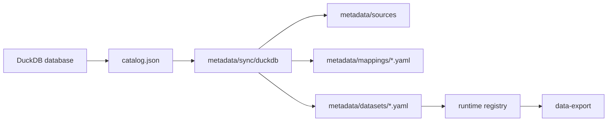

# DuckDB Sync

这里保存 DuckDB connector 发现或同步后的 catalog 快照示例。
这些快照帮助你把 DuckDB 表、视图、字段、类型整理成 RealAnalyst 的 metadata。

---

## 当前示例

| 文件 | 说明 |
| --- | --- |
| `catalog.example.json` | 脱敏后的 DuckDB catalog 示例 |

---

## 推荐流程

---

## 本地可以保存但不要提交

| 文件 | 说明 |
| --- | --- |
| `catalog.json` | 真实 DuckDB catalog |
| `reports/` | connector 生成的本地报告 |
| `*.duckdb` | 真实数据库文件，通常不应放这里 |

---

## 从 catalog 到 metadata 时要补什么？

| catalog 里通常有 | metadata 里还要补 |
| --- | --- |
| 表名 / 视图名 | 业务展示名、适用场景 |
| 字段名 / 类型 | 字段业务定义、角色、证据 |
| 主键或候选键 | 粒度、关联边界 |
| 表注释 | 指标定义、review 状态 |
| 文件路径 | 不应公开的路径要脱敏 |

---

## 常见卡点

| 卡点 | 解决办法 |
| --- | --- |
| catalog 只有字段名，没有业务含义 | 找 owner / 数据字典补业务定义 |
| DuckDB 有多张表都像目标数据 | 先在 metadata 中写清适用场景，再在 runtime 注册 |
| 想直接跨表 join | 先确认粒度和 join key；`data-export` 的 DuckDB 后端默认不做自由跨表 join |
