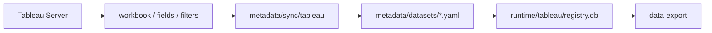

# Tableau Sync

这里保存 Tableau connector 发现或同步后的固定化快照示例。
这些文件帮助你把 Tableau workbook、字段、筛选器和参数整理成 metadata。

---

## 当前示例

| 文件 | 说明 |
| --- | --- |
| `workbook.example.json` | workbook / view 结构示例 |
| `fields.example.json` | 字段清单示例 |
| `filters.example.json` | 筛选器和参数示例 |

---

## 推荐流程

---

## 本地可以保存但不要提交

| 文件 | 说明 |
| --- | --- |
| `workbook.json` | 真实 workbook 快照 |
| `fields.json` | 真实字段快照 |
| `filters.json` | 真实筛选器快照 |
| `reports/` | connector 生成的本地报告 |

---

## 整理到 metadata 时要特别注意

| Tableau 素材 | 需要人工确认的点 |
| --- | --- |
| 字段 display name | 是否等同业务指标名 |
| filter | 是否影响时间、对象、区域、版本 |
| parameter | 是筛选条件还是计算参数 |
| workbook/view | 粒度是否能支撑用户问题 |
| calculated field | 公式是否已确认、是否有 owner |

---

## 常见卡点

| 卡点 | 解决办法 |
| --- | --- |
| display name 与实际字段 token 不一致 | 导出时以 registry 返回的 `tableau_field` 或 `key` 为准 |
| filter / parameter 用混 | 先查 `query_registry.py --filter`，再决定 `--vf` 或 `--vp` |
| Tableau 看板能看但导出字段不全 | 在 metadata 中标注限制，必要时换 DuckDB 明细源 |
