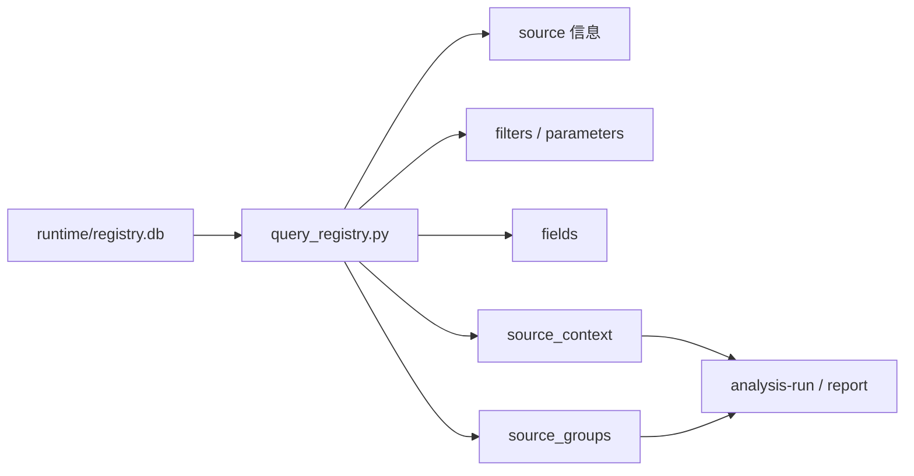

# Tableau Runtime

这里保存 Tableau 执行层代码。
它负责查询已注册 Tableau source、字段、筛选器、参数和 source context，供 `data-export` 受控导出使用。

---

## 文件说明

| 文件 | 作用 |
| --- | --- |
| `query_registry.py` | 查询已注册 Tableau source、字段、筛选器和 source context |
| `sqlite_store.py` | 读写统一本地 `runtime/registry.db`（含 source_groups CRUD） |
| `source_context.py` | 将 source 与指标/维度定义组装成分析上下文 |
| `source_context_contract.md` | 说明 source context 的输出契约 |
| `source_context_mappings.example.yaml` | source 与标准指标/维度映射示例 |

---

## Runtime 查询链路



---

## 常用命令

```bash
python3 runtime/tableau/query_registry.py --source <source_id>
python3 runtime/tableau/query_registry.py --filter <source_id>
python3 runtime/tableau/query_registry.py --fields <source_id>
python3 runtime/tableau/query_registry.py --source <source_id> --with-context
python3 runtime/tableau/query_registry.py --groups
python3 runtime/tableau/query_registry.py --groups <source_id>
```

---

## 重要边界

| 边界 | 说明 |
| --- | --- |
| `registry.db` 不提交 | 它是本地运行时文件 |
| 同步快照不放这里 | Tableau workbook / fields / filters 快照放 `metadata/sync/tableau/` |
| display name 不等于导出 token | 导出参数优先使用 registry 返回的 `tableau_field` 或 `key` |
| source context 不替代 metadata | 它帮助执行阶段映射指标/维度，但业务定义仍来自 metadata |

---

## 常见卡点

| 卡点 | 解决办法 |
| --- | --- |
| 不知道用 `--vf` 还是 `--vp` | 先查 `query_registry.py --filter <source_id>` |
| 字段中文名能看到但导出失败 | 使用 registry 的字段 token，不要直接用展示名 |
| 多个 view 都像目标数据 | 先在 analysis-plan 阶段锁定一个主 source |
