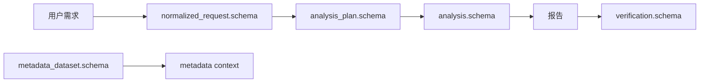

# Schemas

这里保存 RealAnalyst 的 JSON Schema。
Schema 用于约束分析计划、分析结果、验证结果、metadata dataset 和转换 manifest 的结构，让 Agent 输出更稳定、可校验。

---

## 文件索引

| 文件 | 用途 |
| --- | --- |
| `analysis.schema.json` | 分析结果结构 |
| `analysis_plan.schema.json` | 分析计划结构 |
| `manifest.schema.json` | 数据画像或产物 manifest |
| `metadata_conversion_manifest.schema.json` | metadata 转换 manifest |
| `metadata_dataset.schema.json` | dataset YAML / JSON 结构约束 |
| `normalized_request.schema.json` | 用户需求画像结构 |
| `verification.schema.json` | 报告验证结果结构 |

---

## Schema 在流程中的位置

---

## 谁会用到这些 Schema？

| 角色 | 使用方式 |
| --- | --- |
| Agent | 输出结构化 JSON 时对齐字段 |
| 开发者 | 编写脚本和测试时校验契约 |
| 维护者 | 发现字段漂移、缺失或结构不一致 |
| 用户 | 间接受益于更稳定的报告和验证结果 |

---

## 建议使用方式

- 修改 schema 后，同步更新对应 README / docs / skill 引用
- 对新增字段写清是否必填、默认值、失败策略
- 不要让 schema 与 `SKILL.md` 中的输出契约互相矛盾
- demo metadata 应能通过 schema 和 `metadata validate`

---

## 常见卡点

| 卡点 | 解决办法 |
| --- | --- |
| Agent 输出字段名不稳定 | 在 schema 中固定字段名，并在 skill 中引用 |
| report-verify 读不到字段 | 检查 `verification.schema.json` 与脚本输出是否一致 |
| metadata validate 失败 | 检查 `metadata_dataset.schema.json` 与 YAML 写法 |
