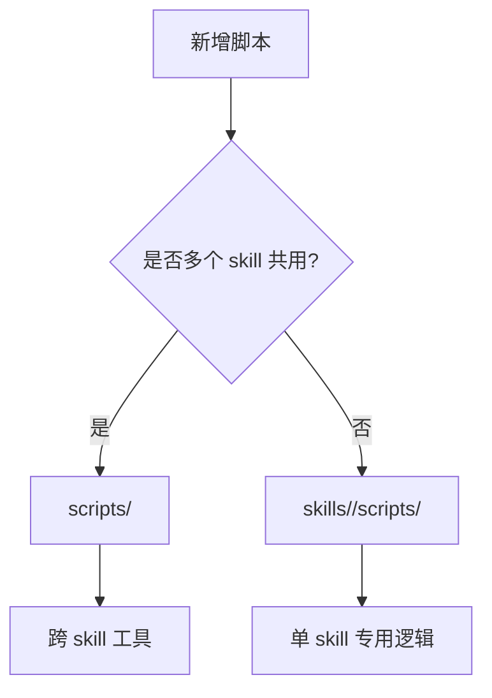

# Scripts

这里保存跨 skill 复用的项目脚本。
如果一个脚本只服务单个 skill，应该放在 `skills/<name>/scripts/`；如果多个 skill 都需要用，才放在这里。

---

## 当前文件

| 文件 | 作用 |
| --- | --- |
| `py` | 统一 Python 执行入口，便于在项目内调用脚本 |
| `setup_venv.sh` | 初始化虚拟环境 |
| `log_acquisition.py` | 记录取数动作到 job 元数据 |
| `update_artifact_index.py` | 更新 job 内产物索引 |

---

## 脚本放置规则

---

## 这里的脚本不应该保存什么？

- 真实业务数据
- 导出 CSV
- 运行日志
- API token
- 本地绝对路径
- 一次性分析结果

这些内容应放在本地 `.env`、`jobs/`、`logs/` 或私有存储中，并避免提交到公开仓库。

---

## 常见卡点

| 卡点 | 解决办法 |
| --- | --- |
| 不知道脚本放哪里 | 先问“是否跨 skill 复用” |
| 脚本需要真实密钥 | 从 `.env` 读取，不写进脚本 |
| 脚本输出没人能追溯 | 写入 `artifact_index.json` 或相应 summary |
| 用户找不到脚本入口 | 在对应 README 写清命令和预期输出 |
