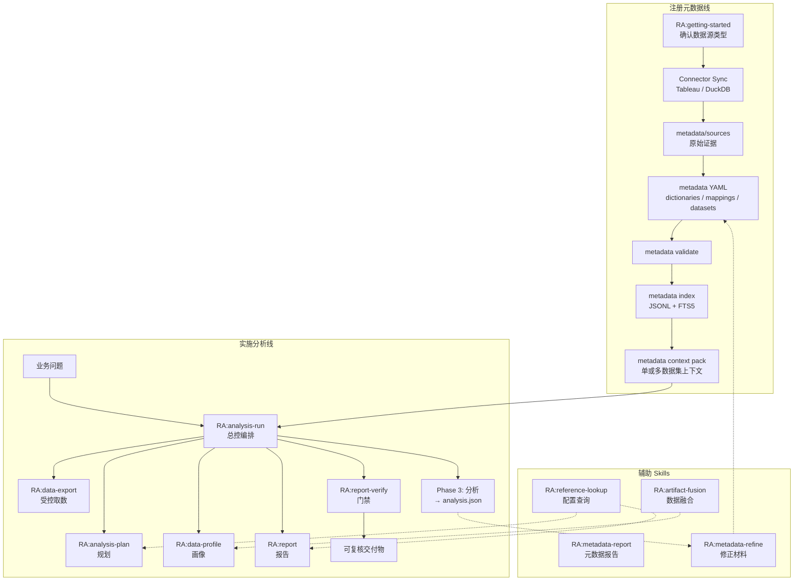
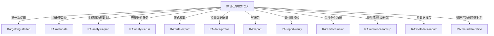
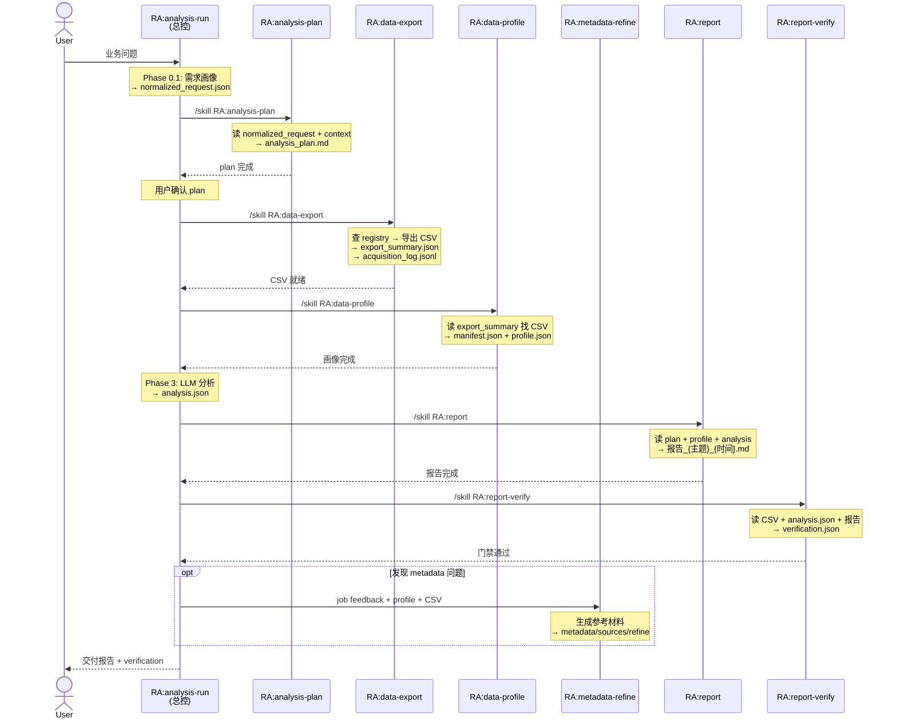
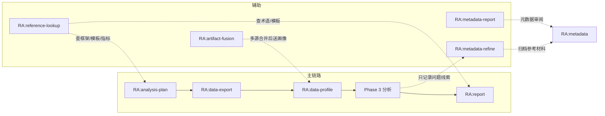

# RealAnalyst Skills

`skills/` 是 RealAnalyst 的完整能力层。每个子目录是一个可独立调用的 Codex skill，由 `SKILL.md`（Agent 执行规则）和 `README.md`（用户说明）组成。

本文档面向**用户和维护者**，覆盖：系统架构、技能清单、使用方法、技能交互关系和运行产物。

---

## 目录

- [系统架构](#系统架构)
- [快速开始](#快速开始)
- [Skill 清单](#skill-清单)
- [Skill 交互总览](#skill-交互总览)
- [两种使用模式](#两种使用模式)
- [数据流与产物](#数据流与产物)
- [后端脚本速查](#后端脚本速查)
- [Schemas 与契约](#schemas-与契约)
- [文件体系](#文件体系)
- [常见卡点](#常见卡点)
- [开发约定](#开发约定)

---

## 系统架构

RealAnalyst 由两条主线组成：**注册元数据线**（把数据源事实沉淀为可审查的 metadata）和**实施分析线**（基于 metadata 完成 plan → export → profile → analysis → report → verify）。

`RA:analysis-run` 是总控编排器，大多数用户只需调用它。



### 分层设计

```
┌─────────────────────────────────────────────────────┐
│  用户层          Codex 对话 / /skill 命令            │
├─────────────────────────────────────────────────────┤
│  编排层          RA:analysis-run（总控）              │
│                  ├── Phase 0: 需求理解 + 规划         │
│                  ├── Phase 1: 受控取数                │
│                  ├── Phase 2: 数据画像                │
│                  ├── Phase 3: 分析 → analysis.json    │
│                  ├── Phase 4: 报告撰写                │
│                  └── Phase 5: 交付门禁                │
├─────────────────────────────────────────────────────┤
│  能力层          12 个独立 skill                      │
│                  getting-started · metadata ·         │
│                  analysis-plan · data-export ·        │
│                  data-profile · report ·              │
│                  report-verify · artifact-fusion ·    │
│                  reference-lookup · metadata-report ·  │
│                  metadata-refine                      │
├─────────────────────────────────────────────────────┤
│  数据层          metadata/   元数据 YAML + 索引       │
│                  runtime/    运行时配置 + registry     │
│                  schemas/    JSON Schema 契约          │
│                  jobs/       会话级工作目录             │
└─────────────────────────────────────────────────────┘
```

---

## 快速开始

### 1. 第一次使用

```text
/skill RA:getting-started
帮我确认数据源类型，并列出抽取元数据前需要准备的信息。
```

### 2. 已有 metadata，做一次完整分析

```text
/skill RA:analysis-run
基于现有 metadata context，帮我生成分析计划，确认后再执行取数、画像、分析和报告。
```

### 3. 只想维护数据源和口径

```text
/skill RA:metadata
帮我注册一个数据集，并维护字段、指标、筛选器和业务口径。
```

### 不知道用哪个 skill？



---

## Skill 清单

### 主链路 Skills

| Skill | 职责 | 主要输入 | 主要输出 |
| --- | --- | --- | --- |
| `RA:getting-started` | 初始引导：确认数据源类型，列出准备清单 | 用户描述 | 准备清单、下一步路径 |
| `RA:metadata` | 元数据管理：注册、校验、索引、搜索、context、catalog、reconcile | layered YAML、dataset id、关键词 | validate / index (FTS5) / catalog / search / context pack / reconcile |
| `RA:metadata-refine` | 元数据修正材料：整理 job 反馈、profile、真实数据探查和证据归档 | job feedback、profile、CSV | `metadata/sources/refine/{refine_id}/` 参考材料，含 `refine_followup.md` |
| `RA:analysis-plan` | 分析规划：假设驱动的 10 章计划 | `normalized_request.json` + metadata context | `.meta/analysis_plan.md` |
| `RA:analysis-run` | **总控编排**：串联全部分析流程 | 用户问题 + 已注册 metadata | job 目录（数据、画像、analysis.json、报告、verification） |
| `RA:data-export` | 受控取数：Tableau / DuckDB | registry source id + filters | `data/*.csv` + `export_summary.json` + acquisition log |
| `RA:data-profile` | 数据画像：schema、质量、信号、统计 | 正式 CSV | `profile/manifest.json` + `profile/profile.json` |
| `RA:report` | 报告撰写：追加写作、模板锁定 | plan + profile + analysis + artifact_index | `报告_{主题}_{时间}.md` |
| `RA:report-verify` | 交付门禁：证据链、排名、趋势、数字追溯 | `data.csv` + `analysis.json` + `report.md` | `verification.json` |

### 辅助 Skills

| Skill | 职责 | 主要输入 | 主要输出 |
| --- | --- | --- | --- |
| `RA:artifact-fusion` | 数据融合：source group 内 union / join / passthrough | 多个 dataset pack | 合并 CSV + lineage manifest |
| `RA:reference-lookup` | 配置查询：模板、指标、术语、框架、维度 | 关键词 | JSON 查询结果 |
| `RA:metadata-report` | 元数据报告：metadata report、注册说明、review gap | dataset YAML、discovery/sync 素材 | Markdown 元数据报告 |

---

## 产物归属

| 产物 | Owner skill |
| --- | --- |
| metadata YAML / index / context / registry sync | `RA:metadata` |
| metadata Markdown report | `RA:metadata-report` |
| CSV / export_summary / acquisition_log | `RA:data-export` |
| `profile/manifest.json` + `profile/profile.json` | `RA:data-profile` |
| `analysis.json` / `analysis_journal` | `RA:analysis-run` |
| 业务报告 Markdown | `RA:report` |
| `verification.json` | `RA:report-verify` |
| refine reference pack | `RA:metadata-refine` |

---

## Skill 交互总览

### 主链路调用关系



### 辅助 Skill 触发点



### Skill 间数据依赖矩阵

| 生产者 ↓ / 消费者 → | analysis-plan | data-export | data-profile | Phase 3 分析 | report | report-verify |
| --- | --- | --- | --- | --- | --- | --- |
| **analysis-run (Phase 0)** | `normalized_request.json` | | | | | |
| **analysis-plan** | | 目标清单 | | | `analysis_plan.md` | |
| **data-export** | | | `export_summary.json` → CSV 路径 | CSV 数据 | | CSV 数据 |
| **data-profile** | | | | `profile.json` 字段语义 | `manifest.json` + `profile.json` | |
| **Phase 3 分析** | | | | | 分析结论 | `analysis.json` |
| **report** | | | | | | 报告 Markdown |
| **reference-lookup** | 框架/维度定义 | | | | 模板/术语 | |
| **metadata** | context pack | registry source | | | | |

---

## 两种使用模式

### 模式一：总控编排（推荐）

直接调用 `RA:analysis-run`，它按 Phase 0 → 5 自动编排所有 skill：

```text
/skill RA:analysis-run
帮我分析上个月的收入变化，已有元数据注册好了。
```

Agent 内部会依次调用 `analysis-plan` → `data-export` → `data-profile` → 分析 → `report` → `report-verify`，中间在关键节点暂停等用户确认。

### 模式二：单 Skill 调用

当你只需要执行某个阶段时，可以直接调用单个 skill：

```bash
# 只注册元数据
/skill RA:metadata

# 只做数据画像
/skill RA:data-profile

# 只验证已有报告
/skill RA:report-verify

# 查运行时配置
/skill RA:reference-lookup
```

> **注意**：`RA:analysis-plan` 依赖 `normalized_request.json`。如果不是从 `RA:analysis-run` 进入，plan skill 会向用户追问必填信息后自行生成该文件。

---

## 数据流与产物

### Job 目录结构

每次分析会话产生一个 job 目录，所有产物集中存放：

```
jobs/{SESSION_ID}/
├── data/                              # 导出的正式 CSV
│   └── *.csv
├── profile/                           # 数据画像
│   ├── manifest.json                  #   schema + lineage
│   └── profile.json                   #   signals + quality + statistics
├── .meta/                             # 过程元数据
│   ├── normalized_request.json        #   需求画像
│   ├── analysis_plan.md               #   分析计划（10 章）
│   ├── acquisition_log.jsonl          #   每次导出动作的审计日志
│   ├── artifact_index.json            #   正式产物索引
│   ├── analysis_journal.md            #   每轮分析日志
│   ├── user_request_timeline.md       #   用户需求时间线
│   └── metadata_feedback.jsonl        #   metadata 问题线索，只供 refine 使用
├── analysis.json                      # 结构化分析结果（verify 输入）
├── 报告_{主题}_{时间}.md               # 报告（追加写作）
├── export_summary.json                # Tableau 导出摘要
├── duckdb_export_summary.json         # DuckDB 导出摘要
├── source_context.json                # Tableau 语义上下文
├── context_injection.md               # Tableau 上下文注入
└── 汇总_*.csv / 交叉_*.csv             # 分析加工产物
```

### 关键产物说明

| 产物 | 生产者 | 消费者 | JSON Schema |
| --- | --- | --- | --- |
| `normalized_request.json` | analysis-run Phase 0 | analysis-plan | `schemas/normalized_request.schema.json` |
| `analysis_plan.md` | analysis-plan | analysis-run, report | `schemas/analysis_plan.schema.json` |
| `export_summary.json` | data-export (Tableau) | data-profile, analysis-run | — |
| `duckdb_export_summary.json` | data-export (DuckDB) | data-profile, analysis-run | — |
| `manifest.json` | data-profile | report | `schemas/manifest.schema.json` |
| `profile.json` | data-profile | analysis-run Phase 3, report | — |
| `metadata_feedback.jsonl` | analysis-run | metadata-refine | — |
| `analysis.json` | analysis-run Phase 3 | report-verify | `schemas/analysis.schema.json` |
| `报告_*.md` | report | report-verify, 用户 | — |
| `verification.json` | report-verify | 用户 | `schemas/verification.schema.json` |
| `metadata/audit/metadata_changes.jsonl` | metadata | metadata | — |
| `metadata/audit/metadata_change_report.md` | metadata | 用户 / reviewer | — |

### Metadata 目录结构

```
metadata/
├── sources/           # 原始证据（connector discovery 归档、用户文档）
├── dictionaries/      # 公共语义层（指标、维度、术语）
├── mappings/          # source 字段 → 标准语义的映射
├── datasets/          # 一个真实可分析对象一份 YAML
├── audit/             # metadata 维护日志和变更报告
├── index/             # 生成层：JSONL + search.db (FTS5) 检索索引
└── osi/               # 生成层：context pack（给 analysis-plan 用）
```

### Runtime 目录结构

```
runtime/
├── registry.db        # 全局唯一 SQLite 运行库（source registry + lookup tables + source_groups）
├── paths.py           # runtime 路径单一来源
├── tableau/           # Tableau 查询与 source context 脚本
├── duckdb/            # DuckDB 注册脚本
└── *.yaml             # 模板、框架等不入库的配置
```

---

## 后端脚本速查

### data-export

| 后端 | 推荐 wrapper（自动写审计日志） | 直接脚本（仅排障） |
| --- | --- | --- |
| Tableau | `skills/data-export/scripts/tableau/tableau_export_with_meta.py` | `skills/data-export/scripts/tableau/export_source.py` |
| DuckDB | `skills/data-export/scripts/duckdb/duckdb_export_with_meta.py` | `skills/data-export/scripts/duckdb/export_duckdb_source.py` |

### data-profile

| 入口 | 说明 |
| --- | --- |
| `skills/data-profile/scripts/run.py` | 推荐：自动从 export_summary 推导 CSV |
| `skills/data-profile/scripts/profile.py` | 底层：手动指定 CSV + 输出目录 |

### reference-lookup

```bash
python3 skills/reference-lookup/scripts/query_config.py --template <关键词>
python3 skills/reference-lookup/scripts/query_config.py --metric <关键词>
python3 skills/reference-lookup/scripts/query_config.py --glossary <关键词>
python3 skills/reference-lookup/scripts/query_config.py --framework <框架名>
python3 skills/reference-lookup/scripts/query_config.py --dimension <关键词>
```

### metadata audit

```bash
python3 skills/metadata/scripts/metadata.py record-change --summary <summary> --path <metadata_yaml>
python3 skills/metadata/scripts/metadata.py record-change --summary <summary> --path <metadata_yaml> --before <old_yaml_copy> --refine-id <refine_id> --evidence metadata/sources/refine/<refine_id>/evidence_manifest.json
python3 skills/metadata/scripts/metadata.py change-report
```

### report-verify

```bash
python3 skills/report-verify/scripts/verify.py <data_csv> <analysis_json> <report_md> <output_dir>
```

### analysis-run (job 初始化)

```bash
SESSION_ID=$(./scripts/py skills/analysis-run/scripts/init_or_resume_job.py --key "<conversation_key>" --prefix discord)
export SESSION_ID
```

---

## Schemas 与契约

所有结构化产物都有对应的 JSON Schema，存放在 `schemas/`：

| Schema | 描述 | 关联 Skill |
| --- | --- | --- |
| `normalized_request.schema.json` | 需求画像 | analysis-run → analysis-plan |
| `analysis_plan.schema.json` | 分析计划 | analysis-plan → report |
| `analysis.schema.json` | 结构化分析结果（findings + statistics） | analysis-run → report-verify |
| `manifest.schema.json` | 数据集 manifest（schema + lineage） | data-profile → report |
| `verification.schema.json` | 验证结果 | report-verify → 用户 |
| `metadata_dataset.schema.json` | 元数据 dataset YAML | metadata |
| `metadata_conversion_manifest.schema.json` | 元数据转换 manifest | metadata |

---

## 文件体系

### SKILL.md 与 README.md 的区别

| 文件 | 读者 | 内容 |
| --- | --- | --- |
| `SKILL.md` | **Codex / Agent** | 执行规则、硬约束、脚本入口、禁止事项 |
| `README.md` | **用户 / 维护者** | 什么时候用、怎么开始、会得到什么、常见卡点 |

两者冲突时优先修 `SKILL.md`，再同步 README。

### 每个 Skill 的标准目录

```
skills/<skill-name>/
├── SKILL.md           # Agent 执行合约
├── README.md          # 用户说明
├── scripts/           # 可执行脚本入口
├── references/        # 细节契约文档（SKILL.md 引用，不复制进来）
└── agents/            # 子 Agent 配置（部分 skill 有）
```

---

## 常见卡点

| 卡点 | 处理 |
| --- | --- |
| 不知道从哪个 skill 开始 | 直接用 `RA:getting-started`（第一次）或 `RA:analysis-run`（已有 metadata） |
| skill 太多看不懂 | 只记一条：`RA:analysis-run` 会自动编排所有主链路 skill |
| 想直接 SQL 分析 | 正式报告用 `RA:data-export`；临时检查可直接用 DuckDB CLI |
| 想融合多个数据源 | 先确认用户同意，再用 `RA:artifact-fusion`（通常由 analysis-run 引导） |
| 报告没证据 | 回到 `RA:report-verify`，检查 `analysis.json` 中的 evidence |
| analysis-plan 独立调用时找不到 normalized_request | Plan skill 会向你追问 5 项必填信息后自行生成 |
| DuckDB 导出后没有 source_context | DuckDB 路径不生成此文件，从 `metadata/osi/<dataset_id>/context.md` 获取等效上下文 |
| verify 脚本报错 | 确认 `analysis.json` 已由 analysis-run Phase 3 生成，且路径正确 |

---

## 开发约定

- **不要把 runtime YAML 复制到 skills/ 下**。运行时配置以 `runtime/` 为唯一权威来源，用 `RA:reference-lookup` 按需查询。
- **SKILL.md 是执行规则的 single source of truth**。细节契约放 `references/`，入口文件保持精简。
- **产物路径不能硬编码猜测**。必须从 `export_summary.json` / `duckdb_export_summary.json` / `artifact_index.json` 读取实际路径。
- **连续分析只追加不重写**。同一 job 内报告、analysis.json、日志都是 append-only。
- **新增 skill 时**：创建子目录 → 写 SKILL.md + README.md → 注册到本文件的 Skill 清单 → 注册到根 README 主能力表。
