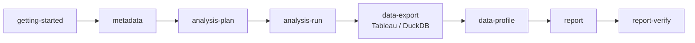
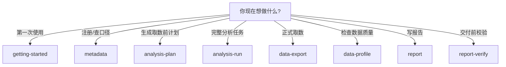

# Skills

`skills/` 是 RealAnalyst 的能力入口。每个子目录都是一个 Codex skill，`SKILL.md` 面向 Agent 执行；本 README 面向用户，帮助判断该用哪个 skill、它会产出什么、下一步去哪里。

---

## 推荐主流程

> 大多数用户不需要逐个调用 skill。可以直接从 `analysis-run` 开始，它会在合适时机调用 planning、export、profile、report 和 verify。

---

## Skill 清单

| Skill | 用户什么时候用 | 主要输入 | 主要输出 |
| --- | --- | --- | --- |
| `getting-started` | 第一次使用，不知道准备什么 | 用户的初始化需求 | 准备清单、下一步路径 |
| `metadata` | 注册数据集、维护字段/指标/术语、生成 context | YAML、source id、关键词 | validate/index/search/context |
| `analysis-plan` | 取数前需要正式计划 | 用户问题 + metadata context | `.meta/analysis_plan.md` |
| `analysis-run` | 想让 RealAnalyst 完整执行一次分析 | 用户问题、已注册 metadata | job、数据、画像、报告 |
| `data-export` | 已锁定 Tableau 或 DuckDB source，需要正式导出 | source id、filters/fields、SESSION_ID | CSV、summary、source context、acquisition log |
| `data-profile` | 导出数据后，分析前要做画像 | 正式 CSV | profile manifest / profile json |
| `report` | 分析完成后写报告 | plan、profile、analysis、artifact_index | 报告 Markdown |
| `report-verify` | 报告交付前做质量门禁 | 数据、分析结果、报告 | `verification.json` |
| `artifact-fusion` | 明确需要合并多个数据产物 | 多个 dataset pack | 合并数据 + lineage manifest |
| `reference-lookup` | 按需查模板、指标、术语、框架 | 关键词 | JSON 查询结果 |

---

## 选择建议

---

## `data-export` 后端脚本

| 后端 | 推荐 wrapper | 直接脚本 |
| --- | --- | --- |
| Tableau | `skills/data-export/scripts/tableau/tableau_export_with_meta.py` | `skills/data-export/scripts/tableau/export_source.py` |
| DuckDB | `skills/data-export/scripts/duckdb/duckdb_export_with_meta.py` | `skills/data-export/scripts/duckdb/export_duckdb_source.py` |

推荐优先使用 wrapper，因为它们会自动写入 `.meta/acquisition_log.jsonl` 与 `.meta/artifact_index.json`。

---

## SKILL.md 与 README.md 的区别

| 文件 | 读者 | 内容 |
| --- | --- | --- |
| `README.md` | 用户、维护者、贡献者 | 什么时候用、怎么开始、会得到什么、卡住怎么办 |
| `SKILL.md` | Codex / Agent | 严格执行规则、硬约束、脚本入口、禁止事项 |

如果两者冲突，应优先修 `SKILL.md`，再同步 README，避免用户文档和执行规则分裂。

---

## 常见卡点

| 卡点 | 处理 |
| --- | --- |
| 不知道从哪个 skill 开始 | 直接用 `getting-started` 或 `analysis-run` |
| skill 太多看不懂 | 先记住主链路：`metadata → analysis-plan → analysis-run → data-export → data-profile → report → report-verify` |
| 想直接 SQL 分析 | 如果是正式报告，优先用 `data-export`；临时检查可直接用本地 DuckDB CLI |
| 想融合多个数据源 | 先确认用户同意新增 source，再考虑 `artifact-fusion` |
| 报告没证据 | 回到 `report` 和 `report-verify`，补证据链 |
