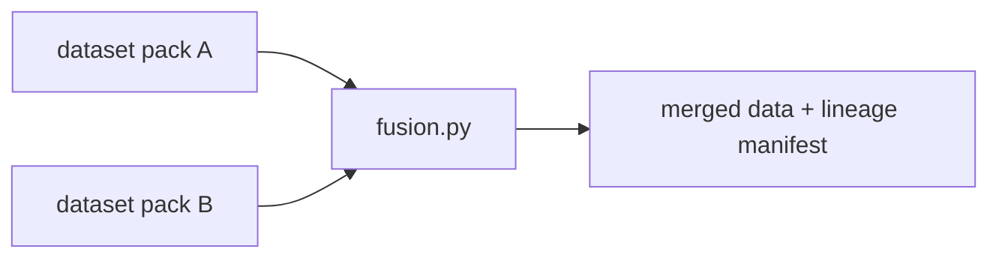

# Artifact Fusion Skill

在明确需要时合并多个 dataset pack，并生成带 lineage 的 manifest。

---

## 什么时候用？

- source group 内多次 export 完成后，需要合并数据集
- 多个中间结果需要 union/join/passthrough
- 需要保留输入来源和合并策略

### 典型触发场景

| 场景 | 说明 |
| --- | --- |
| 多个 Tableau 视图导出后需要拼接 | 结构相同的多个 CSV，用 `union` 纵向合并 |
| 主表需要补充维表字段 | 用 `join` 横向拼列（注意：当前是按索引拼列，非键 join） |
| 分析过程中发现需要新数据源 | 用户确认后，`RA:data-export` 导出第二份数据，再用 fusion 合并 |

### 从哪个 skill 过来？

通常在 `RA:analysis-plan` 确定 source group 后触发。完整路径：

1. `RA:analysis-plan` 确定 source group（1 primary + 至多 2 supplementary）
2. 用户在 plan 确认时一并通过 source group
3. `RA:data-export` 分别完成 group 内各 source 的导出
4. `RA:artifact-fusion` 合并 group 内数据集
5. `RA:data-profile` 画像合并后的数据
6. 继续分析

source group 持久化到 `registry.db`，下次相同 primary source 自动推荐已有 group。查询已有 group：`query_registry.py --groups [source_id]`。

---

## 输入与输出

| 类型 | 内容 |
| --- | --- |
| 输入 | 多个包含 manifest.json + data.csv 的输入目录<br/>strategy<br/>output_dir |
| 输出 | 合并后的 data.csv<br/>manifest.json<br/>lineage 信息 |
| 下一步 | `RA:data-profile / RA:report` |

---

## 流程图



---

## 快速示例

```bash
python3 skills/artifact-fusion/scripts/fusion.py union jobs/job_001/merged jobs/job_001/ds_a jobs/job_001/ds_b
```

---

## 用户会得到什么？

- 合并后的数据文件。
- 记录输入来源、合并策略和字段处理方式的 manifest。
- 可用于后续画像或报告的 lineage 信息。
- 如果多个输入粒度不一致，会暴露风险，不会静默合并。

---

## 常见卡点

| 卡点 | 处理方式 |
| --- | --- |
| 不知道是否该用这个 skill | 先看“什么时候用”；不确定时从 `RA:analysis-run` 开始，它会在合适时机引导你调用 fusion |
| 找不到输入文件 | 回到上游 skill，确认是否已经生成正式产物 |
| 输出和预期不一致 | 检查输入数据粒度、join key 和合并策略 |
| 涉及 `needs_review` | 报告里必须标注为待确认或推断口径 |
| 涉及新增数据源 | 先让用户确认，再执行 |
