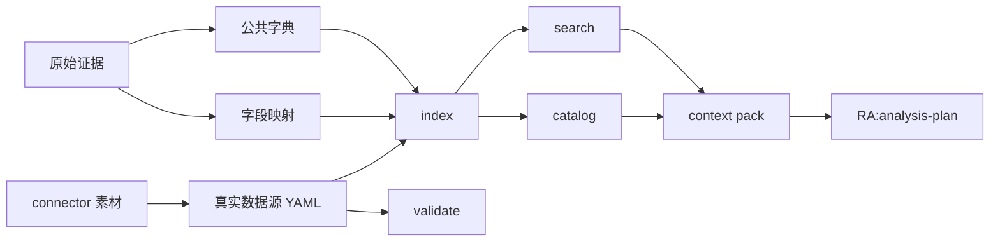

# Metadata Skill

统一处理数据集注册、字段/指标/术语维护、校验、索引、搜索、精确读取和 context pack 生成。

---

## 什么时候用？

- 注册新数据集
- 维护字段或指标定义
- 分析前查询口径
- Tableau / DuckDB onboarding 后整理语义层
- 生成 analysis-plan 的 context

---

## 输入与输出

| 类型 | 内容 |
| --- | --- |
| 输入 | metadata/sources 原始证据<br/>metadata/dictionaries 公共语义<br/>metadata/mappings 字段映射<br/>metadata/datasets 真实数据源<br/>dataset id<br/>指标/字段/术语关键词 |
| 输出 | validate 结果<br/>metadata/index/*.jsonl + search.db (FTS5)<br/>catalog 数据集摘要<br/>search 结果（BM25 排序）<br/>read 精确数据集事实<br/>context pack（单或多数据集 / multi-dataset）<br/>reconcile 一致性报告<br/>可选 OSI export |
| 下一步 | `RA:analysis-plan` |

---

## 流程图



---

## 快速示例

```bash
python3 skills/metadata/scripts/metadata.py validate
python3 skills/metadata/scripts/metadata.py index
python3 skills/metadata/scripts/metadata.py catalog
python3 skills/metadata/scripts/metadata.py catalog --domain finance
python3 skills/metadata/scripts/metadata.py search --type all --query revenue
python3 skills/metadata/scripts/metadata.py read --dataset-id demo.retail.orders
python3 skills/metadata/scripts/metadata.py context --dataset-id demo.retail.orders --metric total_revenue
python3 skills/metadata/scripts/metadata.py context --dataset-id id_1 --dataset-id id_2
python3 skills/metadata/scripts/metadata.py reconcile
python3 skills/metadata/scripts/metadata.py validate --completeness
python3 skills/metadata/scripts/metadata.py profile-review --dataset-id demo.retail.orders --refine-id <refine_id>
```

---

## 用户会得到什么？

- 可校验的 dataset YAML。
- 可追溯的 source 原始材料归档。
- 公共指标、维度、术语字典。
- source 字段映射和口径覆盖。
- 字段、指标、术语和 open questions 的维护结果。
- 可搜索的 metadata index（FTS5 全文检索）。
- 可精确读取的 dataset facts（供 report 和 agent 使用，不从 Markdown 反解析）。
- 数据集目录摘要（catalog）。
- 本轮分析需要的 context pack（支持多数据集 / multi-dataset）。
- 运行时 vs 元数据一致性报告（reconcile）。
- 完整性校验报告（`validate --completeness`：metric-like fields / metric mappings / sample-profile 证据）。
- profile/refine 完整性建议（`profile-review`：Markdown + JSON 建议，不自动改 YAML）。

---

## 常见卡点

| 卡点 | 处理方式 |
| --- | --- |
| 不知道是否该用这个 skill | 先看“什么时候用”；不确定时从 `RA:analysis-run` 开始 |
| 找不到输入文件 | 回到上游 skill，确认是否已经生成正式产物 |
| 输出和预期不一致 | 检查 YAML 中的 dataset id、metric id、mapping_ref 和 review 状态 |
| 公共字典被放进 datasets | 拆到 `metadata/dictionaries/`，`datasets/` 只放真实数据源 |
| 原始材料只在 Downloads | 复制到 `metadata/sources/` 后再引用 |
| 涉及 `needs_review` | 报告里必须标注为待确认或推断口径 |
| 涉及新增数据源 | 先让用户确认，再执行 |

---

## 脚本清单

`skills/metadata/scripts/metadata.py` 是统一入口；下列脚本是它各子命令背后的实现模块，一般不单独调用：

| 脚本 | 由 `metadata.py` 子命令调用 |
| --- | --- |
| `init_metadata.py` | `init` |
| `validate_metadata.py` | `validate` |
| `build_index.py` | `index` |
| `build_inventory.py` | `inventory` |
| `metadata_audit.py` | `change-report` / `record-change` / `record-relation` |
| `enrich_definitions.py` | `enrich-definitions` |
| `sync_registry.py` | `sync-registry` |
| `status_registry.py` | `status` |
| `search_metadata.py` | `search` |
| `read_metadata.py` | `read` |
| `build_context.py` | `context` |
| `build_catalog.py` | `catalog` |
| `reconcile_metadata.py` | `reconcile` |
| `profile_review.py` | `profile-review` |
| `export_osi.py` | `export-osi` |

其余内部脚本：

- `_bootstrap.py`：定位 workspace 根目录的内部 helper（被各脚本 import，不单独调用）。
- `write_review_gap_report.py`：为待确认 metadata 定义生成 Markdown review-gap 报告的独立维护工具。
