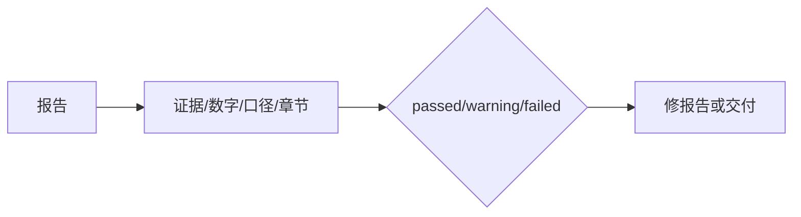

# Report Verify Skill

交付前检查报告是否有证据链、是否误用口径、排名趋势是否一致、是否包含必备章节。

---

## 什么时候用？

- 报告交付前
- 需要机器可读 verification.json
- 报告中有 needs_review 口径
- 需要判断是否能通过最终门禁

---

## 输入与输出

| 类型 | 内容 |
| --- | --- |
| 输入 | 正式 CSV<br/>analysis.json<br/>report.md<br/>output_dir |
| 输出 | verification.json<br/>stdout JSON 状态<br/>passed/warning/failed 检查清单 |
| 下一步 | `交付给用户，或返回 report 修正` |

---

## 流程图



---

## 快速示例

```bash
python3 skills/report-verify/scripts/verify.py jobs/job_001/data/xxx.csv jobs/job_001/analysis.json jobs/job_001/报告_xxx.md jobs/job_001
```

---

## 用户会得到什么？

- `passed`、`warning` 或 `failed` 的验证状态。
- 哪些结论缺少证据、哪些口径需要复核。
- 可以回到 report 修正的具体问题。
- 交付前是否可以放行的判断依据。

---

## 常见卡点

| 卡点 | 处理方式 |
| --- | --- |
| 不知道是否该用这个 skill | 先看“什么时候用”；不确定时从 `analysis-run` 开始 |
| 找不到输入文件 | 回到上游 skill，确认是否已经生成正式产物 |
| 输出和预期不一致 | 检查报告、分析 JSON 和 CSV 是否来自同一个 job |
| 涉及 `needs_review` | 报告里必须标注为待确认或推断口径 |
| 涉及新增数据源 | 先让用户确认，再执行 |
